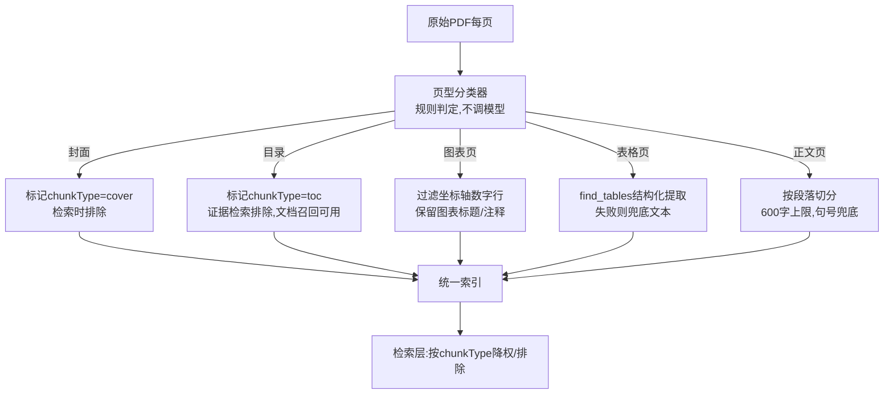
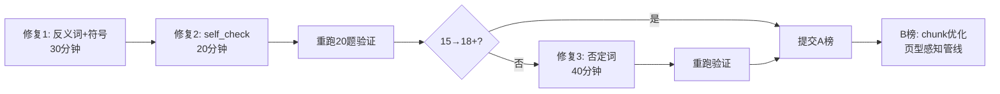

evidence	内容	字数	问题
ev5 (p3)	目录页（"一、自主IP驱动..."带页码索引）	1705字	纯目录，无信息量
ev7 (p4)	图表目录页（"图表1 芯原股份..."带页码索引）	3478字	纯目录，无信息量
维度	当前	改进
目录页过滤	❌ 不过滤	在预处理时识别目录页（含大量"....页码"模式）并跳过/降权
chunk 上限	800字（细粒度）	正文 chunk 500-600 字（和 Qwen 截取长度匹配）
目录/正文分离	❌ 混在一起	目录页单独标记为 chunkType="toc"，检索时降权或排除
图表数据	图表坐标轴数字混入文本	用 find_tables() 提取结构化表格，图表噪音过滤更彻底

对于这个chunk细化的问题，是否有更好的方案

### **有更好的方案。你列的四点(目录过滤、缩短 chunk、类型分离、表格提取)方向都对,但作为四个独立补丁来加,会越加越碎、越维护越乱。更好的做法是合成一条统一的"页型感知分块管线":先对每页分类(封面/目录/正文/图表/表格),再按页型走不同的分块策略,最后在检索层按类型降权——而不是在预处理层删删改改。**

现在距 A 榜截止还有约 10 小时,我会把这个方案分成"今晚能做完的快速版"和"B 榜用的完整版"两层来讲。

---

### **一、你列的方案有什么问题**

你的四点各自都对,但叠在一起有两个结构性问题:

**第一,目录页删了就没了,但 B 榜需要它。** B 榜没有 doc_ids,要先做文档级召回。目录页恰恰是判断"这篇文档讲了什么"最好的信号——它列出了所有章节标题和主题。你现在 A 榜把它当噪音删掉,B 榜又得想办法找回来。正确做法是**标记不删除**,检索时按用途决定用不用。

**第二,chunk 缩到 500-600 字是"形"不是"神"。** 你想缩短是因为 Qwen 每条证据截取 600 字、800 字的 chunk 末尾被截断。但真正的问题不是字数,是**截断点可能在句子中间或数值描述中间**。固定 500 字切,如果正好切在"营收微降"和"8.47%"之间,反而更糟。应该按**自然边界(段落/句号)切,用 600 字做上限兜底**,而不是反过来用 600 字硬切。

---

### **二、更好的方案:页型感知分块管线**

核心思路是:**预处理阶段只做分类和标记,不做删除;检索阶段按类型做降权或排除。** 这样最灵活,A 榜 B 榜都能用,改参数不用重新跑预处理。



这条管线的关键改进是:**每个 chunk 都带 `page_type` 字段,这个字段在检索层和 reasoner 层都能用。** 检索时可以"cover/toc 降权 0.1 倍";reasoner 判断时可以"如果证据全是 toc 类型,confidence 上限封 0.3"。这比你现在的"预处理时删掉"灵活得多。

---

### **三、页型分类器怎么写(纯规则,不调模型,合规零风险)**

这是整条管线的入口,用规则判定,不消耗 Token,不涉及任何模型。

```python
import re
from collections import Counter

# 目录页检测:点引导线 + 页码模式的高密度页
_TOC_LINE_PATTERN = re.compile(r'[…·.\s]{3,}\s*\d{1,3}\s*$')
# 匹配 "一、自主IP驱动..................3" 这类行

# 封面页检测
_COVER_MARKERS = {"证券研究报告", "投资评级", "分析师", "SAC编号", "请阅读最后一页"}

# 图表轴标签行:整行几乎全是数字/百分号
_NUMERIC_LINE_PATTERN = re.compile(r'^[\d\s%,.+\-/]+$')


def classify_page(page_text: str, page_num: int, blocks: list) -> str:
    """
    对单页文本分类,返回 cover/toc/chart/table/body 之一。
    全部用规则,不调模型。
    """
    lines = [l.strip() for l in page_text.split('\n') if l.strip()]
    if not lines:
        return "blank"

    # ── 封面页:通常在前2页,含报告标记,行数少 ──
    if page_num <= 2:
        marker_hits = sum(1 for m in _COVER_MARKERS if m in page_text)
        if marker_hits >= 2 and len(lines) < 20:
            return "cover"
        # 也有可能是带标题的正文首页,继续往下判断

    # ── 目录页:点引导线行占比 > 40% ──
    toc_lines = sum(1 for l in lines if _TOC_LINE_PATTERN.search(l))
    if toc_lines / len(lines) > 0.4:
        return "toc"

    # ── 图表页:数字行占比 > 60%,且中文占比低 ──
    numeric_lines = sum(1 for l in lines if _NUMERIC_LINE_PATTERN.match(l))
    if numeric_lines / len(lines) > 0.6:
        return "chart"

    # ── 表格页:PyMuPDF的find_tables能检测到表格结构 ──
    # (在调用方传入blocks时检测,这里先粗判)
    if _looks_like_table(lines):
        return "table"

    # ── 默认正文 ──
    return "body"


def _looks_like_table(lines: list) -> bool:
    """粗判是否为表格:多列对齐(连续多行有相似的空格列结构)"""
    if len(lines) < 3:
        return False
    # 统计每行的空格分段数,如果多行都是3+列,可能是表格
    col_counts = []
    for l in lines[:10]:
        parts = re.split(r'\s{2,}', l)
        if len(parts) >= 3:
            col_counts.append(len(parts))
    return len(col_counts) >= 3 and len(col_counts) / len(lines[:10]) > 0.5
```

这段代码的逻辑是:
- **目录页**靠"点引导线 + 页码"模式的高密度识别,你的 ev5(p3,1705 字)和 ev7(p4,3478 字)就是典型——大量 `....3`、`....12` 这种行。
- **封面页**靠"证券研究报告/投资评级/分析师"等标记词 + 行数少识别,你的 020-C 错误就是 p1 封面页被当证据。
- **图表页**靠数字行占比 >60% 识别,你 v3 记录里"图表坐标轴数字混入文本"就是这个。
- **表格页**靠多列对齐粗判,后面用 `find_tables()` 精确提取。

---

### **四、每种页型怎么分块**

分类之后,不同页型走不同策略。这是比"统一 800 字切"好得多的地方——**正文按段落切保证语义完整,图表页过滤噪声,表格页结构化提取,目录页保留但不参与证据检索。**

```python
def chunk_page(page_text, blocks, page_type, page_num, doc_id, 
               max_chunk=600):
    """按页型分块,返回chunk列表"""
    chunks = []
    
    if page_type == "cover":
        # 封面:保留但不参与证据检索
        chunks.append({
            "doc_id": doc_id, "page": page_num,
            "chunk_type": "cover",
            "text": page_text[:200],  # 只保留标题摘要
            "page_type": "cover",
        })
        return chunks
    
    if page_type == "toc":
        # 目录:整页保留为一个chunk,标记类型
        chunks.append({
            "doc_id": doc_id, "page": page_num,
            "chunk_type": "toc",
            "text": page_text,
            "page_type": "toc",
        })
        return chunks
    
    if page_type == "chart":
        # 图表页:过滤纯数字行,保留标题和注释
        lines = page_text.split('\n')
        kept = [l for l in lines 
                if not _NUMERIC_LINE_PATTERN.match(l.strip())]
        clean_text = '\n'.join(kept).strip()
        if clean_text and len(clean_text) > 20:
            chunks.append({
                "doc_id": doc_id, "page": page_num,
                "chunk_type": "chart",
                "text": clean_text,
                "page_type": "chart",
            })
        return chunks
    
    if page_type == "table":
        # 表格页:优先用find_tables结构化提取
        tables = _extract_tables_structured(blocks, page_num, doc_id)
        if tables:
            chunks.extend(tables)
        else:
            # 兜底:按文本切
            chunks.extend(_chunk_body(page_text, page_num, 
                                       doc_id, max_chunk))
        return chunks
    
    # 正文:按段落切,600字上限,句号兜底
    return _chunk_body(page_text, page_num, doc_id, max_chunk)


def _chunk_body(text, page_num, doc_id, max_len=600):
    """正文按段落切,段落超长则按句号二次切分"""
    chunks = []
    paragraphs = [p.strip() for p in text.split('\n\n') if p.strip()]
    
    buf = ""
    for para in paragraphs:
        if len(buf) + len(para) <= max_len:
            buf += para + '\n'
        else:
            if buf:
                chunks.append(_make_chunk(buf, page_num, doc_id))
                buf = ""
            # 超长段落按句号切
            if len(para) > max_len:
                sentences = re.split(r'(?<=[。；！？])', para)
                s_buf = ""
                for s in sentences:
                    if len(s_buf) + len(s) <= max_len:
                        s_buf += s
                    else:
                        if s_buf:
                            chunks.append(_make_chunk(s_buf, page_num, doc_id))
                        s_buf = s
                buf = s_buf
            else:
                buf = para + '\n'
    if buf:
        chunks.append(_make_chunk(buf, page_num, doc_id))
    return chunks


def _make_chunk(text, page_num, doc_id):
    return {
        "doc_id": doc_id, "page": page_num,
        "chunk_type": "body",
        "text": text.strip(),
        "page_type": "body",
    }
```

`_chunk_body` 的关键改进是:**先按段落(空行)切,段落不超长就整段保留(哪怕只有 200 字也不合并,因为段落是天然的语义单元);段落超长才按句号二次切分。** 这比固定 600 字硬切更不会切断语义。

---

### **五、检索层怎么用 page_type**

这一步是"标记不删除"策略的回报——预处理只打标签,过滤逻辑放在检索层,改参数不用重跑预处理。

```python
# retriever.py — rank_chunks 增加页型降权
_TYPE_WEIGHT = {
    "body": 1.0,
    "table": 1.0,      # 表格数据和正文同等权重
    "chart": 0.5,      # 图表注释降权(信息密度低)
    "toc": 0.05,       # 目录页几乎排除,但保留极小权重防全空
    "cover": 0.0,      # 封面直接排除
}

def _apply_type_weight(score, chunk):
    page_type = chunk.get("page_type", "body")
    return score * _TYPE_WEIGHT.get(page_type, 1.0)
```

`_TYPE_WEIGHT` 是个可调字典,不需要改代码就能调:如果发现 chart 降权太狠漏了真实证据,改成 0.7;如果发现 toc 的 0.05 还是会干扰,改成 0.01。**这比在预处理层删删灵活得多——删了就回不来了。**

---

### **六、find_tables 怎么用(给 B 榜,今晚跳过)**

你记录里提到"图表坐标轴数字混入文本",根因是 `get_text('blocks')` 把图表和表格里的数字都当普通文本提取了。`find_tables()` 能区分结构化表格和图表噪音,但它的稳定性取决于 PDF 版面复杂度,需要兜底。

```python
def _extract_tables_structured(page, page_num, doc_id):
    """用PyMuPDF的find_tables提取结构化表格"""
    tables = []
    try:
        tab_finder = page.find_tables()
        for tab in tab_finder.tables:
            records = tab.extract()  # 返回二维列表(行×列)
            if not records or len(records) < 2:
                continue
            # 转成文本行:"指标 | 2024 | 2025"
            lines = []
            for row in records:
                cells = [str(c).strip() if c else "" for c in row]
                lines.append(" | ".join(cells))
            chunks.append({
                "doc_id": doc_id, "page": page_num,
                "chunk_type": "table",
                "text": "\n".join(lines),
                "page_type": "table",
            })
        return chunks if tables else None
    except Exception:
        return None  # 兜底:调用方走文本切分
```

**注意**:`find_tables()` 在 PyMuPDF 1.23+ 才有,如果你的版本低可能没有这个方法。今晚 A 榜不用做这个——图表噪音用上面 `_NUMERIC_LINE_PATTERN` 过滤纯数字行已经能压掉大部分。`find_tables()` 留给 B 榜。

---

### **七、今晚的优先级(距 A 榜截止约 10 小时)**

说实话,chunk 优化是个"系统性收益"——它不会直接修好某一道题,而是整体降低噪声。而你那五道错题的修复(上一轮我给的修复 1-5)是"定向收益"——每修一个能确定拿回一道题。**在不到 10 小时的窗口里,定向收益优先。**

所以今晚的建议优先级:



**第一优先:做上一轮的修复 1+2(反义词扩展 + self_check 冲突检测),重跑验证,提交 A 榜。** 这两个加起来 50 分钟,预期能拿回 001、008、019-C 三题。

**第二优先:如果还有时间,做修复 3(否定词上下文)+ 修复 4(证据实质检查),再跑一次。** 这两个能拿回 019-A、020-B、020-C。

**chunk 优化(页型感知管线)放到 A 榜提交之后、B 榜之前做。** B 榜 7 月 22 日 0 点开始,你有 22 日一整天来做这个——它需要重建 `chunks_hybrid.jsonl` 和 lexical_index,跑一遍全量预处理,不适合在 A 榜最后几小时动。

---

### **八、这个方案比你列的四点好在哪**

| 维度 | 你列的方案 | 页型感知管线 |
|---|---|---|
| 目录页处理 | 预处理时删掉 | 标记 `toc` 类型,B 榜文档召回仍可用 |
| 封面页 | 未提及 | 识别并排除,直接修 020-C |
| chunk 大小 | 固定 500-600 字 | 段落优先 + 600 字上限兜底,不切断语义 |
| 类型分离 | toc 单独标记 | 五种类型全覆盖(cover/toc/chart/table/body) |
| 图表噪音 | find_tables 提取 | 先过滤纯数字行(今晚可做),find_tables 作为 B 榜增强 |
| 灵活性 | 预处理层改了要重建 | 检索层调权重字典即可,不重跑预处理 |
| reasoner 可用性 | chunk 只有 text | chunk 带 `page_type`,reasoner 可按类型封 confidence 上限 |

最后一点值得强调:**page_type 传到 reasoner 是一个额外收益。** 比如 020-C 的封面页证据,如果 reasoner 看到 `page_type="cover"`,可以直接把 confidence 封顶到 0.3,不需要依赖 `_check_evidence_substance` 的数值匹配逻辑——页型本身就是"这条证据可不可靠"的信号。

你先决定今晚是先做修复 1+2 还是直接上 chunk 优化,我可以把对应的代码补完整。如果你把 `reasoner.py` 和 `preprocess_research_fine.py` 贴给我,我直接给你可替换的 diff。

*内容由 AI 生成仅供参考*