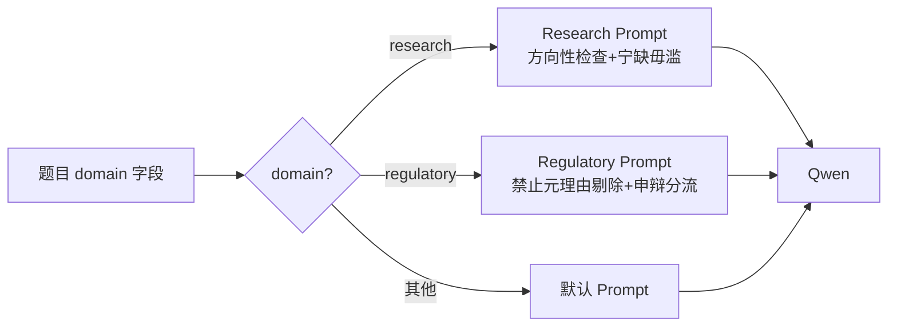
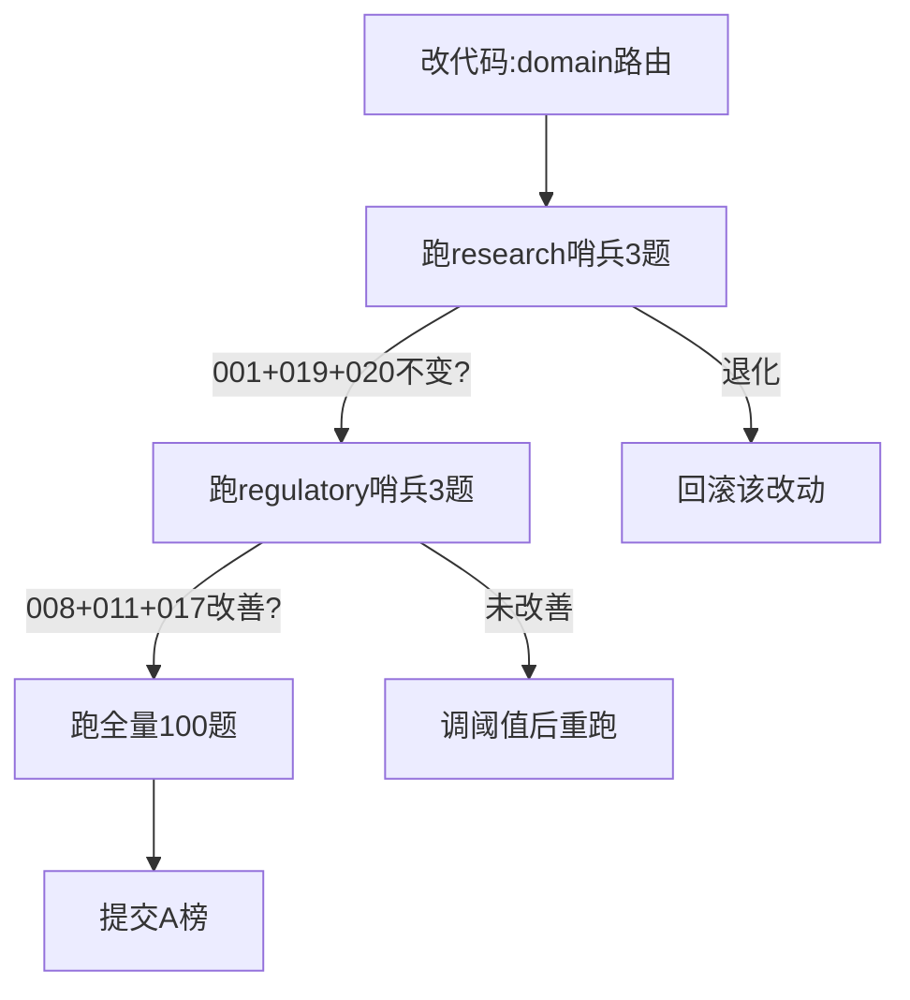

这个优化会不会影响之前优化方案的效果

### **会。而且影响可能不小——因为 research 域和 regulatory 域的失败模式恰好相反:research 是"多选假选项"(过度选择),regulatory 是"漏选真选项"(过度剔除)。用同一套改动覆盖两个域,很容易按下葫芦浮起瓢。**

现在是 17:43,距 A 榜 20:00 截止还有约 2 小时。我把冲突点和隔离方案讲清楚,你根据时间决定改不改。

---

### **一、三个真实冲突点**

#### **冲突 1(高危):P0-3「多选禁止元理由剔除」会加重 research 域的过度选择**

这是最大的冲突。

- **Regulatory 域**的 011-D、020-D 错误是:Qwen 已经找到了正确证据,却以"主题偏移"为由主动丢掉 → **需要让它别丢**。
- **Research 域**的 001-D、017-C、019-C、020-C 错误是:Qwen 选了不该选的假选项 → **需要让它更保守,该丢的丢掉**。

如果你把"禁止元理由剔除已证选项"加进 multi 题的全局 prompt,效果是:

| 域 | 期望效果 | 实际风险 |
|---|---|---|
| Regulatory | ✅ 011-D、020-D 不再被丢 | — |
| Research | ❌ Qwen 更不敢丢假选项 | 001/017/019/020 可能退化到 ABCD 全选 |

**这个改动如果做成全局的,research 域大概率退化 2~3 分,得不偿失。**

#### **冲突 2(中危):P0-1 否定词作用域收窄,可能削弱 research 域的反义词拦截**

Research 域的修复靠的是 `_ANTONYM_PAIRS` 检查"增长 vs 微降"。这个检查目前是在 `_check_numeric_context()` 里做的,通常会扫数值附近窗口。

如果 P0-1 把否定词检测改成"仅当紧邻核心谓语才触发 refute",有两种可能:

- 如果 P0-1 **只改否定词逻辑**(`不/不得/未/停止`)、不动反义词对检查 → **不冲突**,安全。
- 如果 P0-1 把整个 `_check_numeric_context` 的窗口收窄了 → 反义词"微降"可能落在窗口外,001-D 退化。

**关键看实现时是否把否定词逻辑和反义词逻辑分函数处理。**

#### **冲突 3(低危):Prompt 膨胀稀释注意力**

Research 域已经加了方向性检查指令,Regulatory 再加处罚文书规则、多选强制规则,prompt 会越来越长。Qwen 对长 prompt 里靠后的约束关注度会下降,可能导致 research 域的方向性检查被"淹没"。

---

### **二、隔离方案:按 domain 路由,不要做全局改动**

核心原则:**research 和 regulatory 的 prompt 模板必须分开,改动只注入到对应域。**



具体改法:

```python
# qwen_client.py — 按 domain 注入不同约束段
def build_system_prompt(domain: str, answer_format: str) -> str:
    base = "你是金融文档阅读理解助手。只能依据给定证据选择答案，不得编造。"
    
    if domain == "research":
        # Research 域：方向性检查 + 宁缺毋滥（抑制过度选择）
        return base + """
【方向性检查】
1. 选项说"增长"但证据说"下降/微降/回落" → 该选项为假
2. 数值符号相反（+3.6% vs -3.6%）→ 不支持
3. "显著增长" vs "先升后降" → 不支持
4. 核心数值（如千亿）未在证据中出现 → 证据不足
5. 宁可漏选，不可错选。"""
    
    elif domain == "regulatory":
        # Regulatory 域：禁止元理由剔除 + 申辩分流（抑制过度剔除）
        return base + """
【多选题规则】
1. doc_ids 范围内证据已支持的选项必须入选，不得以"主题偏移"排除
2. 只有直接逻辑矛盾才可排除已证选项
3. 未入选选项必须有明确反证
【处罚文书规则】
- "当事人提出/申辩"属申辩意见，不得作为正确选项依据
- "本会认为/经查/决定"属监管认定，可作为依据
- 禁止充分条件逆推"""
    
    else:
        # 其他域：默认保守
        return base + "宁可漏选，不可错选。"
```

这样改的代价只是 prompt 拼装时多一个 `if domain` 分支,不会让两个域互相干扰。

---

### **三、Reasoner 层的隔离**

reasoner.py 的改动也要分域处理。P0-1(否定词作用域)和 P0-2(或/才陷阱)主要是 regulatory 域的条文特征,在 research 域很少出现"或/才"这种逻辑结构。但仍建议加一个域判断兜底:

```python
# reasoner.py — _check_numeric_context 内部
def _check_numeric_context(option_text, evidence_text, domain="default"):
    # ── 通用检查（所有域都跑）──
    # 反义词检查（research 的增长/微降 + regulatory 的有条件/无条件）
    antonym_result = _check_antonym_pairs(option_text, evidence_text)
    if antonym_result:
        return antonym_result
    
    # 符号检查（所有域）
    symbol_result = _check_symbol_conflict(option_text, evidence_text)
    if symbol_result:
        return symbol_result
    
    # ── 域专属检查 ──
    if domain == "regulatory":
        # 否定词作用域（P0-1）：只改 regulatory，不动 research 的窗口
        negate_result = _check_negation_scope_regulatory(option_text, evidence_text)
        if negate_result:
            return negate_result
        # 或/才陷阱（P0-2）
        logic_result = _check_or_caii_trap(option_text, evidence_text)
        if logic_result:
            return logic_result
    elif domain == "research":
        # 核心数值必须出现（P0-4 变体：020 的千亿检查）
        substance_result = _check_core_substance(option_text, evidence_text)
        if substance_result:
            return substance_result
    
    return None  # 无冲突
```

**关键是:`_check_antonym_pairs` 和 `_check_symbol_conflict` 是所有域共享的通用检查,不能因为 regulatory 的改动而收窄它们的窗口。** 新增的否定词作用域和或/才陷阱只在 `domain == "regulatory"` 分支里跑。

---

### **四、Retriever 层基本不冲突**

P1-1(施行日期尾部补录)只在 query 含日期关键词时触发,research 域的题目几乎不会问"施行日期",所以低风险。但保险起见,加一个触发条件:

```python
def _needs_tail_supplement(query: str, domain: str) -> bool:
    if domain not in ("regulatory", "financial_contracts"):
        return False  # research/reports 域不触发
    return any(kw in query for kw in EFFECTIVE_DATE_TRIGGERS)
```

---

### **五、回归验证清单(必须做)**

改完后不能只跑 regulatory 20 题,**必须同时跑 research 20 题**,确认无退化。时间紧的话至少跑这几道"哨兵题":

| 域 | 哨兵题 | 检查什么 |
|---|---|---|
| Research | res_a_001 | D 仍然被 refute(增长/微降拦截仍在) |
| Research | res_a_019 | C 仍然被 refute(符号检测仍在) |
| Research | res_a_020 | C 不被选入(封面页/千亿检查仍在) |
| Regulatory | reg_a_008 | A 不再被误 refute |
| Regulatory | reg_a_011 | D 不再被元理由丢弃 |
| Regulatory | reg_a_017 | C 不再被选入(申辩分流) |



---

### **六、时间紧迫下的最终建议**

现在是 17:43,20:00 截止。我的建议是:

**如果只有 1~1.5 小时改代码:只做 prompt domain 路由(冲突 1 的隔离),不做 reasoner 改动。** 把 `qwen_client.py` 的 system prompt 按 domain 分流,是性价比最高、回归风险最低的改动——research 域加"宁缺毋滥",regulatory 域加"禁止元理由剔除+申辩分流"。改一个函数,跑 6 道哨兵题验证,就能提交。

**如果有 2 小时:prompt 路由 + retriever 施行日补录。** 后者改动小、收益明确(019-A),且不影响 research 域。

**reasoner 的 P0-1/P0-2 留到 B 榜。** 否定词作用域和或/才陷阱的逻辑较复杂,匆忙上线容易引入退化,不值得在最后 2 小时冒险。

一句话总结:**这两个域的失败模式相反,绝不能共用同一套 prompt 和 reasoner 逻辑,必须从代码层面按 domain 路由隔离。** 你现在能把 `build_system_prompt` 改成 domain 分流版本吗?改完我帮你确认 research 域不会退化。

*内容由 AI 生成仅供参考*