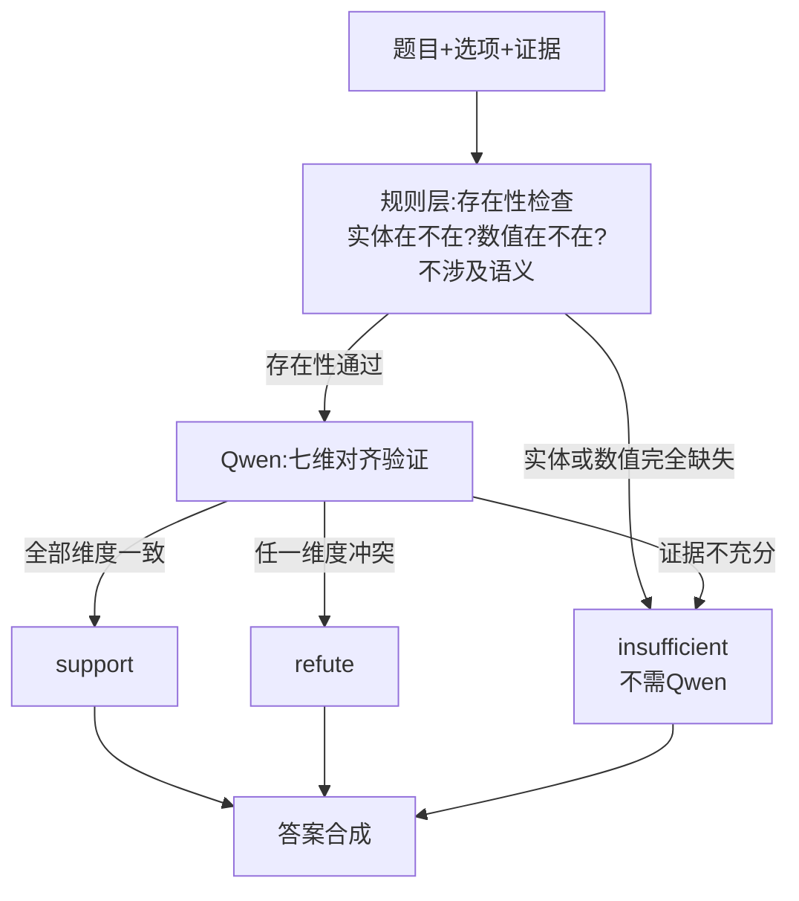

你上面的优化很多都太特定化了，针对一道错误模式给出一个解决方案，想打补丁一样。有没有更通用的方法，或者针对不同的领域使用大模型来进行兜底，但是大模型的提示词也写的完整，能够适应各种边缘场景

### **你说得对。我之前给的方案本质上是在"打地鼠"——增长/微降加一对、先升后降加一对、或/才加一条、申辩加一段——每修一个就冒出新的,而且 research 和 regulatory 的补丁还会互相打架。这套做法不可持续,也不泛化。**

正确的思路应该是:**把语义判断的活儿还给 Qwen,但给它一个结构化的"验证框架",让它系统性地检查所有可能的矛盾类型,而不是靠枚举具体反义词。规则层退化为只做"存在性检查"(实体/数值在不在证据里),不再试图做语义推理。**

---

### **一、为什么打补丁走不通**

你现在的架构是"Qwen 主判 + reasoner 安全网"。问题在于:

- reasoner 试图用规则做语义推理(反义词、否定词、逻辑结构),但规则的覆盖面永远是有限的
- 每次发现新的矛盾类型(增长→微降→先升后降→+3.6%/-3.6%),就得加一对
- 更糟的是,research 域需要 reasoner 激进 refute(抑制过度选择),regulatory 域需要 reasoner 保守(防止误杀义务句)——**同一套规则无法同时满足两种相反的需求**

根本矛盾在于:**规则做不了语义,而 Qwen 能做语义但没被要求做。**

---

### **二、通用方案:结构化验证框架**

核心思路:**给 Qwen 一个通用的"七维对齐验证"框架,让它对每个选项系统检查所有矛盾维度,而不是靠枚举具体词对。规则层只做轻量存在性检查。**



### **三、Qwen 的结构化验证 Prompt**

这个 prompt 是整个方案的核心。它不枚举任何具体反义词,而是要求 Qwen 对每个选项逐一走七个维度的检查:

```text
你是金融文档合规验证器。对每个选项执行结构化验证后，再决定是否入选。
不得编造，不得使用外部知识，仅依据给定证据。

## 对每个选项，依次检查以下七个维度：

### 1. 实体对齐
证据讨论的主体（公司/人/国家/产品）是否与选项一致？
- 选项说"芯原股份"但证据讲"博通" → 冲突
- 选项说"宇信科技"但证据讲"长亮科技" → 冲突

### 2. 数值对齐
证据中的数值是否与选项完全一致？
- 正负号是否一致（+3.6% vs -3.6% → 冲突）
- 单位是否一致（美元 vs 人民币 vs 欧元 → 冲突）
- 量级是否一致（千亿 vs 百亿 → 冲突）
- 选项的核心数值是否在证据中直接出现（未出现 → 证据不足）

### 3. 方向/趋势对齐
证据描述的变化方向是否与选项一致？
- 选项说"增长"但证据说"下降/微降/回落/下跌" → 冲突
- 选项说"显著增长/持续增长"但证据说"先升后降/冲高回落" → 冲突
- 不限于具体词汇：只要方向矛盾即为冲突

### 4. 逻辑结构对齐
证据的逻辑连接方式是否与选项一致？
- 选项说"只有达到X才需要"但证据说"A或者B" → 冲突
- 选项说"必须"但证据说"可以" → 冲突
- 选项说排他性条件但证据给并列条件 → 冲突

### 5. 修饰语对齐
选项中的限定词是否在证据中出现？
- 选项说"名义"但证据只说"实际" → 冲突
- 选项说"无条件"但证据说"有条件" → 冲突
- 选项说"手动"但证据说"自动" → 冲突
- 选项有限定词但证据完全没提 → 证据不足

### 6. 来源/角色对齐（法规/处罚类文档）
证据是权威认定还是当事人申辩？
- "当事人提出/申辩/认为" → 申辩意见，不可单独作为正确依据
- "本会认为/经查/决定如下" → 监管认定，可作为依据

### 7. 范围对齐
证据是否真正回答了选项的问题？
- 如果文档在参考范围内且证据直接支持选项的事实陈述，不得以"主题偏移"为由排除
- 只有当选项与题干存在直接逻辑矛盾时才可排除

## 输出格式（严格JSON）：
{
  "A": {
    "verdict": "support|refute|insufficient",
    "evidence_quote": "引用原文关键句",
    "conflicts": ["维度名: 一句话描述冲突"],
    "all_dimensions_checked": true
  },
  "B": { ... },
  ...
}

## 最终答案规则：
- 多选题：只选 verdict="support" 的选项。有任一维度冲突 → 不选。证据不足 → 不选。
- 单选题：选 support 最强的选项。全部 insufficient 时选冲突最少的。
- 宁可漏选，不可错选。
```

### **四、这个 prompt 为什么通用**

把你的所有错题套进去,你会发现**不需要任何域专属规则,七维框架天然覆盖了每种错误模式**:

| 错题 | 出错的维度 | 框架如何捕获 |
|---|---|---|
| res_a_001 D(增长/微降) | 维度3:方向对齐 | "增长" vs "微降"方向矛盾 → refute |
| res_a_008 A(停止任职被误refute) | 维度3:方向对齐 | "停止任职"不等于"否定结论",Qwen理解语义而非匹配否定词 |
| res_a_008 D(1000美元/才) | 维度4:逻辑结构 | "才"是排他条件 vs 证据"或者" → 冲突 |
| res_a_011 D(被元理由剔除) | 维度7:范围对齐 | 文档在范围内且证据支持,不得排除 |
| res_a_017 C(申辩当法条) | 维度6:来源对齐 | "当事人提出" → 不可作正确依据 |
| res_a_019 C(+3.6%/-3.6%) | 维度2:数值对齐 | 符号相反 → 冲突 |
| res_a_020 C(芯原/博通/千亿) | 维度1+2:实体+数值 | 实体不同+千亿未出现 → 冲突 |
| reg_a_019 A(施行日漏召回) | 维度2:数值对齐 | 证据里没有日期 → insufficient(触发补检索) |

**关键区别:这个框架不关心具体是哪两个词矛盾,它只问"有没有矛盾"。** Qwen 做语义判断的能力远强于规则枚举,你只需要给它一个系统化的检查清单,让它不遗漏检查维度。

---

### **五、规则层(reasoner)的角色大幅简化**

在通用方案下,reasoner 不再做语义推理,只做**存在性检查**:

```python
def quick_existence_check(option_text, evidence_text):
    """
    轻量预过滤:只检查存在性,不做语义判断
    返回:pass / insufficient
    """
    # 1. 核心实体是否存在
    entities = extract_entities(option_text)  # 规则抽取公司名/法规名等
    for e in entities:
        if e not in evidence_text:
            return "insufficient", 0.3, f"核心实体'{e}'未在证据中出现"
    
    # 2. 核心数值是否存在(保留正负号,但不做反义词判断)
    numbers = extract_numbers_with_sign(option_text)
    for n, sign in numbers:
        if n not in evidence_text:
            # 数值完全不存在 → 证据不足
            return "insufficient", 0.3, f"核心数值'{n}'未在证据中出现"
    
    # 3. 不做反义词检查、不做否定词检查、不做逻辑结构检查
    # 这些全部交给 Qwen 的七维验证
    
    return "pass", 1.0, "存在性检查通过,交由Qwen验证"
```

**这个 reasoner 永远不会误判"停止任职"为否定,因为它根本不做否定词检测;也永远不会漏掉"微降"这种反义词,因为它根本不做反义词检测。** 它只管"实体和数值在不在",语义判断全部交给 Qwen。

---

### **六、合并策略也大幅简化**

```python
def merge_answers(qwen_verdicts, reasoner_existence, answer_format):
    """
    Qwen 的结构化验证结果为主,reasoner 只在存在性检查失败时兜底
    """
    final = []
    for option, qwen_result in qwen_verdicts.items():
        # reasoner 存在性检查失败的,Qwen 也看不到完整证据,不选
        if reasoner_existence[option]["verdict"] == "insufficient":
            continue
        # Qwen 七维验证全部通过 → 选
        if qwen_result["verdict"] == "support":
            final.append(option)
        # Qwen 有冲突 → 不选
        # Qwen 证据不足 → 不选
    
    if answer_format == "multi":
        return "".join(sorted(final))
    elif answer_format == "single":
        # 选 support 最强的
        return final[0] if final else ""
    else:  # tf
        return final[0] if final else ""
```

**没有 P0 merge,没有 refute_veto,没有阈值调参。** Qwen 做完七维验证后,结论就是最终结论。reasoner 只在"实体/数值完全缺失"时拦一下,这种情况 Qwen 本来也判不对。

---

### **七、域差异怎么处理**

不需要维护三套 prompt。**七维框架是通用的,只需在每个维度里给 Qwen 一个领域提示**:

```text
注意：不同文档类型需重点关注不同维度：
- 行业研报：重点检查维度1(实体)、维度2(数值符号)、维度3(方向趋势)
- 监管法规：重点检查维度4(逻辑结构)、维度6(来源角色)、维度7(范围)
- 保险条款：重点检查维度3(方向)、维度4(逻辑结构)
- 财务报表：重点检查维度2(数值单位)、维度5(修饰语)
- 金融合同：重点检查维度2(数值)、维度4(逻辑结构)
```

这样 research 域 Qwen 会更关注方向和实体(抑制过度选择),regulatory 域 Qwen 会更关注逻辑和来源(抑制过度剔除),但用的是同一个框架、同一套 prompt。

---

### **八、Token 消耗评估**

你可能会担心七维验证的 prompt 更长、Qwen 输出更多。实际情况:

- **prompt 增量**:七维框架约 400 token,但这是 system prompt,只算一次
- **输出增量**:每个选项多输出 conflicts 和 evidence_quote,约多 200~300 token/题
- **省掉的**:不再需要 self_check 二次调用、不再需要多轮重试(因为 Qwen 一次就把所有维度查完了)

**净效果大概率是省 Token 的**——你 v6 里 self_check 和重试调用占了不少 Token,而七维验证是一次性的。

---

### **九、今晚 2 小时能做什么**

说实话,完整换到七维框架需要改 `qwen_client.py` 的 prompt 和输出解析、改 `reasoner.py` 为存在性检查、改 `run.py` 的合并逻辑。2 小时偏紧。

**如果你今晚决定做,最快的路径是:只改 `qwen_client.py` 的 system prompt,不动 reasoner 和 run.py。** 让 Qwen 用七维框架输出结构化 JSON,但在 `run.py` 里只取 `verdict` 字段当结果(忽略 reasoner 的 pre-judgment)。这样 reasoner 的输出虽然还在,但不影响最终答案——等于 Qwen 直接说了算。

```python
# run.py — 最小改动:Qwen 七维验证结果直接用
qwen_result = qwen_client.structured_verify(question, options, evidence, domain)
final_answer = format_from_verdicts(qwen_result, answer_format)
# 不再 merge reasoner pre-judgment
```

如果来不及改输出解析,更简单的做法:**只把七维框架的检查清单加到现有 system prompt 里,让 Qwen 在输出答案前先做一遍自检。** 不改输出格式,只改 prompt 约束。这是 30 分钟能做完的版本,虽然不如结构化输出干净,但已经能显著提升 Qwen 的判断质量。

---

### **十、这个方案的核心优势**

| 维度 | 打补丁方案 | 七维验证框架 |
|---|---|---|
| 新错误类型出现 | 加一条规则/一对反义词 | 框架天然覆盖,无需改 |
| 域间冲突 | 需要分域 prompt 隔离 | 同一框架+域提示,无冲突 |
| reasoner 误判 | 不断收窄/放宽阈值 | reasoner 不做语义,无误判 |
| 可维护性 | 规则表越来越长 | 框架固定,只调 prompt 措辞 |
| B 榜泛化 | 新文档类型可能触发新 bug | 七维通用,B 榜直接适用 |
| Token | 多轮自检/重试 | 单轮七维,大概率更省 |

**一句话:不要试图用规则枚举所有矛盾类型,而要给 Qwen 一个系统化的检查框架,让它自己发现矛盾。规则只做它擅长的存在性检查,语义判断完全交给模型。** 这才是可持续的架构,而不是永远在补丁上叠补丁。

*内容由 AI 生成仅供参考*