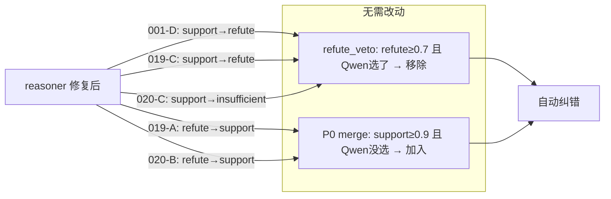
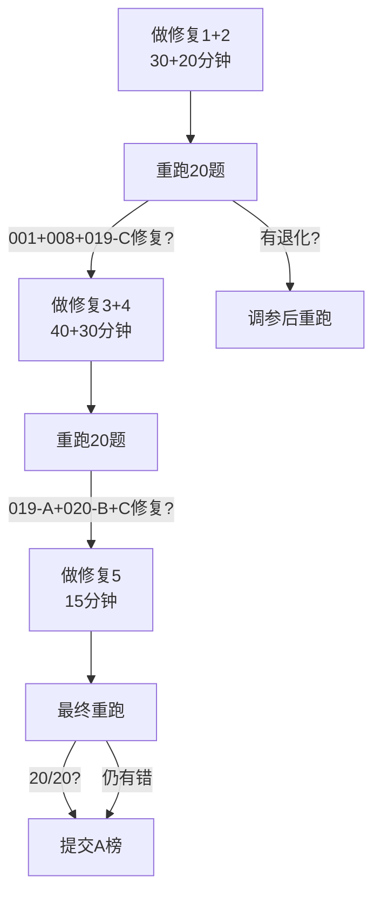

@research_5题错误推理轨迹详细报告.md 根据这个轨迹来进一步分析，然后看怎么进行优化

### **这份轨迹报告非常有帮助,它正好补上了我上一轮要的"五道错题完整 trace"。现在我有了每题的召回证据、reasoner 分数、Qwen 返回和合并分支,可以把优化方案精确到代码逻辑层面了。**

不过有一点必须先提醒:**今天是 7 月 21 日,A 榜今晚 20:00 截止,距现在约 10 小时。** 下面的方案我按"能在几小时内做完并重跑验证"来排优先级,而不是按理论最优。

---

### **一、五题错误的根因归类:不是五个独立 bug,是三个结构性漏洞**

逐题分析后,这 5 题实际只暴露了 reasoner(规则安全网)的三个结构性漏洞。关键洞察是:**你的系统架构是"Qwen 主判 + reasoner 安全网(refute_veto / P0 merge)",所以只要把 reasoner 的洞补上,现有的合并机制会自动纠正 Qwen 的错误选择。**

| 漏洞 | 影响哪些题的哪些选项 | 表现 |
|---|---|---|
| **方向性检测有盲区** | 001-D(增长/微降)、019-C(+3.6%/-3.6%)、017-C(显著增长/先升后降) | reasoner 该 refute 却判了 support,导致 refute_veto 无从发力 |
| **Qwen-reasoner 冲突无感知** | 008(Qwen 选了 reasoner 判 insufficient 的 B) | needs_self_check 只看"有没有 support",不看"Qwen 选的是不是 support" |
| **证据实质检查 + 否定词误触发** | 020-C(千亿未出现却 support)、019-A & 020-B(剔除导致误 refute) | 该拦的没拦,该放的误杀 |

这里要特别说明一点:**为什么 reasoner 修好了就能纠错——因为现有合并机制是现成的。** 001-D 如果 reasoner 从 support 改判 refute(0.85),refute_veto 会自动把它从 Qwen 的 ABCD 里移除,最终变 ABC。019-A 如果 reasoner 从 refute 改回 support(0.95),P0 merge 会自动把它加回 Qwen 的 BC 里,最终变 AB。**你不需要改合并逻辑,只需要修 reasoner 的判定准确度。**



---

### **二、优先级修复方案(按"几小时能做完 + 零退化风险"排序)**

#### **修复 1:扩展反义词表 + 符号保留(预计 30 分钟,修 001-D + 019-C,低风险)**

这是最直接的修复,两道题同时受益。

**001-D 的根因**:`_ANTONYM_PAIRS` 里只有 `({"增长"}, {"下降"})`,但证据用的是"微降"。

**019-C 的根因**:`_extract_numbers` 把 "+3.6%" 和 "-3.6%" 都提取成 "3.6",丢了符号。

两处改动:

```python
# reasoner.py — _ANTONYM_PAIRS 扩展
_ANTONYM_PAIRS = [
    # 原有
    ({"增长", "同比增长", "上升", "提升", "增加"}, 
     {"下降", "下滑", "降低", "减少", "微降", "负增长", "回落", "下跌"}),
    # 新增:趋势模式矛盾
    ({"显著增长", "持续增长", "大幅增长"}, 
     {"先升后降", "先涨后跌", "先升后跌", "冲高回落", "高开低走"}),
    # 新增:条件性反义词
    ({"无条件"}, {"有条件"}),
    ({"手动"}, {"自动"}),
    ({"盈利"}, {"亏损"}),
    ({"欧元"}, {"美元"}),
    ({"名义"}, {"实际"}),
    # ... 你原有的都保留
]
```

```python
# reasoner.py — _extract_numbers 保留符号
def _extract_numbers(text):
    """提取数字时保留正负号,返回 (数值, 符号) 元组列表"""
    results = []
    # 匹配带正负号的百分比和数值
    for m in re.finditer(r'([+-]?)\s*(\d+\.?\d*)\s*%', text):
        sign = m.group(1) or '+'
        if sign == '-':
            results.append((m.group(2), '-'))
        else:
            results.append((m.group(2), '+'))
    # 不带百分号的数字(年份等不带符号,sign='+')
    for m in re.finditer(r'(?<![+-])(\d+\.?\d*)(?!\s*%)', text):
        results.append((m.group(1), '+'))
    return results

# _check_numeric_context 增加符号比较
def _check_numeric_context(option_nums, evidence_nums, option_text, evidence_text):
    for o_num, o_sign in option_nums:
        for e_num, e_sign in evidence_nums:
            if o_num == e_num and o_sign != e_sign:
                # 数值相同但符号相反 → refute
                return ("refute", 0.85, 
                        f"数值{o_sign}{o_num} 与证据{e_sign}{e_num}符号相反")
    # ... 原有的反义词检查逻辑
```

**退化风险分析**:符号保留只影响带正负号的数值比较。对于不带符号的数字(如"2500亿""1000条"),`sign` 默认为 `+`,与原来行为一致。反义词扩展只新增了真正的反义对,不会误杀。

**预期效果**:001-D 从 support→refute → refute_veto 移除 D → ABC ✅。019-C 从 support→refute → refute_veto 移除 C ✅。

---

#### **修复 2:needs_self_check 增加 Qwen-reasoner 冲突检测(预计 20 分钟,修 008,低风险)**

008 的根因非常清晰:reasoner 判 A=support(0.95),但 Qwen 选了 B(insufficient)。当前 `needs_self_check` 只看"有没有 support",不看"Qwen 选的是不是 support 那个"。

```python
# reasoner.py 或 run.py — needs_self_check 修复
def needs_self_check(qwen_answer, results, answer_format):
    """
    单选/判断题:当 Qwen 答案与 reasoner 高置信 support 不一致时,触发自检
    """
    if answer_format in ("single", "tf"):
        # 找出 reasoner 高置信 support 的选项
        high_supports = {
            r["option"] for r in results 
            if r["verdict"] == "support" and r["confidence"] >= 0.9
        }
        # 情况1:Qwen 选了 reasoner 认为是 insufficient/refute 的选项
        if high_supports and qwen_answer not in high_supports:
            return True  # 冲突 → 触发自检
        # 情况2:reasoner 没有任何 support
        return len(high_supports) == 0
    return False
```

自检时给 Qwen 的补充信息应该把矛盾点挑明:

```python
def build_self_check_prompt(qwen_answer, results, evidence):
    conflict = [r for r in results 
                if r["verdict"] == "support" and r["confidence"] >= 0.9 
                and r["option"] != qwen_answer]
    hint = f"你选择了{qwen_answer},但证据分析显示{[r['option'] for r in conflict]}有高置信度支持。" \
          f"请重新审查:你选的{qwen_answer}是否有充分证据支持?" if conflict else ""
    # ... 拼接到原 prompt
```

**退化风险分析**:这只新增了一个触发条件,不会改变已有路径的行为。自检给 Qwen 第二次机会,而不是直接覆盖 Qwen——即使 reasoner 的 support 是错的(如 008 的 D 也是误判 support),Qwen 自检后仍可以维持原判断。风险极低。

**预期效果**:008 自检触发 → Qwen 重新审视 B vs A → A ✅。

---

#### **修复 3:否定词上下文检查——区分"方法论剔除"和"否定选项"(预计 40 分钟,修 019-A + 020-B,中风险)**

019-A 和 020-B 都是因为证据里出现了"剔除"一词,reasoner 就触发了 refute。但这两处的"剔除"是计算方法论("剔除X后,PE为10-15倍"),不是在否定选项的结论。

```python
# reasoner.py — 否定词上下文检查
_NEGATION_WORDS = {"不", "非", "未", "并非", "没有", "无"}
# "剔除"单独处理:它是方法论词,不是否定词
_METHODOLOGY_WORDS = {"剔除", "扣除", "排除", "调整后", "扣非"}

def _check_negation_context(option_text, evidence_text, matched_number):
    """
    检查否定词是否真正否定选项结论,还是只是方法论描述
    """
    # 在匹配数值附近找否定词/方法论词
    context = _get_context_around_number(evidence_text, matched_number, window=30)
    
    # 如果否定词直接修饰选项结论(如"并非...10-15倍")→ refute
    for neg in _NEGATION_WORDS:
        if neg in context and _is_modifying_claim(neg, context, matched_number):
            return ("refute", 0.85, f"否定词'{neg}'直接否定结论")
    
    # 如果是方法论词(如"剔除...后,PE为10-15倍")→ 不是 refute
    for method in _METHODOLOGY_WORDS:
        if method in context:
            # 检查结构:"剔除X后" + 结论 → 结论仍然成立
            if re.search(rf'{method}.{{0,15}}[后则].{{0,20}}{re.escape(matched_number)}', context):
                return None  # 不是否定,放行
    
    return None
```

关键逻辑是:**"剔除……后,PE 为 10-15 倍"这句话支持选项"PE 估值为 10-15 倍",不该 refute。** "剔除"修饰的是计算步骤,不是 PE 结论。

**退化风险分析(中等)**:这个修改改变了否定词的触发条件,如果判断逻辑写得不好,可能放过真正的否定。建议在 20 题全量上验证——如果 019-A 和 020-B 修复了,且其他题没有新增错误,就安全。

**预期效果**:019-A 从 refute→support → P0 merge 加回 A ✅。020-B 从 refute→support → P0 merge 加回 B ✅。

---

#### **修复 4:证据实质检查更严格——核心数值必须在证据中出现(预计 30 分钟,修 020-C,中风险)**

020-C 的根因:选项核心数值"千亿"没在证据中出现,但"FY27"→"27"的数字碎片匹配让它过了 `_check_evidence_substance`。

```python
# reasoner.py — _check_evidence_substance 更严格
def _check_evidence_substance(option_text, evidence_text, option_nums, option_entities):
    """
    检查证据是否包含选项的核心实质内容
    """
    # 1. 核心数值检查:选项中的"大额数值标记"必须在证据中出现
    #    千亿/百亿/万亿 这种量级词,或者带单位的金额
    core_markers = _extract_core_numeric_markers(option_text)
    # 例如:"千亿" → core_marker="千亿"
    for marker in core_markers:
        if marker not in evidence_text:
            return ("insufficient", 0.3, 
                    f"核心数值标记'{marker}'未在证据中出现")
    
    # 2. 实体一致性:选项中的核心实体必须在证据中出现
    for entity in option_entities:
        if entity not in evidence_text:
            return ("insufficient", 0.3,
                    f"核心实体'{entity}'未在证据中出现")
    
    # 3. 封面页过滤:title/cover 类型的 chunk 不应作为独立证据
    #    (在 retriever 层面更好,但 reasoner 也可以兜底)
    if _is_cover_page(evidence_text):
        return ("insufficient", 0.2, "证据为封面页,无实质内容")
    
    return None

def _extract_core_numeric_markers(text):
    """提取选项中的核心数值标记,如千亿/百亿/2500亿/9000亿"""
    markers = []
    # 量级词:千亿、百亿、万亿
    for m in re.finditer(r'([千百十万亿]+)\s*亿', text):
        markers.append(m.group())
    # 带单位的金额
    for m in re.finditer(r'(\d+[.,]?\d*)\s*(亿|万)', text):
        markers.append(m.group().replace(' ', ''))
    return markers
```

**退化风险分析(中等)**:如果 `_extract_core_numeric_markers` 把"2025"也当核心数值,会误拦合法证据。所以只提取"千亿/百亿/万亿"这种量级词和"X亿"这种带量级的金额,不提取年份(年份是弱标记)。在 20 题上验证即可。

**预期效果**:020-C 从 support→insufficient → 不被 Qwen 选入 ✅。

---

#### **修复 5:Qwen 多选题 prompt 增加方向性检查指令(预计 15 分钟,辅助修 017-C,低风险)**

017-C("显著增长" vs "先升后降")是五题里最难的,因为它是语义矛盾,纯规则很难稳定捕获。修复 1 的反义词扩展能部分覆盖(加了"先升后降"对),但更可靠的是让 Qwen 自己检查方向。

```python
# qwen_client.py — 多选题 prompt 追加方向性检查指令
MULTI_SELECT_DIRECTIONAL_CHECK = """

在判断每个选项前,必须执行以下方向性检查:
1. 方向词一致:选项说"增长/上升"时,证据必须是增长/上升方向;
   如果证据说"下降/微降/回落/下跌",该选项错误。
2. 符号一致:选项说"+3.6%"时,证据必须也是正数;
   如果证据说"-3.6%",该选项错误。
3. 趋势一致:选项说"显著增长/持续增长"时,证据不能是"先升后降/冲高回落";
   复合趋势不等于持续增长,该选项错误。
4. 核心数值必须直接出现:选项的核心数字(如"千亿")必须在证据原文中找到;
   如果只在封面页或目录页找到实体名但找不到核心数值,该选项证据不足。
"""
```

**退化风险分析(低)**:这是给 Qwen 加约束,不改代码逻辑。唯一风险是 Qwen 理解不了或过度执行,但方向性检查是合理约束,不会误杀真正正确的选项。在 20 题上验证。

**预期效果**:017-C 的 Qwen 在看到"先升后降趋势"后,能识别这与"显著增长"矛盾,不选 C ✅。同时也加固了 001/019/020 的 Qwen 侧防线。

---

### **三、修复效果预估与验证路径**

把五个修复叠在一起,理论上的效果是:

| 题目 | 当前 | 修复后 | 哪个修复起作用 |
|---|---|---|---|
| 001 | ABCD | ABC | 修复1(反义词)+ 修复5(prompt) |
| 008 | B | A | 修复2(self_check) |
| 017 | ABCD | ABD | 修复5(prompt)+ 修复1(趋势对) |
| 019 | ABC | AB | 修复1(符号)+ 修复3(否定词修A) |
| 020 | ABCD | ABD | 修复4(实质检查)+ 修复3(否定词修B) |

如果全部生效:15/20 → **20/20**。但实际能拿回几道,取决于修复的准确度和有没有引入退化。建议按下面路径验证:



每次重跑只跑 research 域 20 题(你有 GT 对照),几分钟就能验证。先做修复 1+2(最低风险),确认有增益再做 3+4。

---

### **四、关于是否需要看源码**

这份 trace 已经给了我足够的逻辑信息来做上面五个修复的设计。但如果你想要我给出**精确到行号的 diff 级补丁**(而不是逻辑伪代码),我需要看 `reasoner.py` 里的这几个函数的实际实现:

- `_ANTONYM_PAIRS` 的完整定义(看现有覆盖了哪些对)
- `_check_numeric_context()` 的完整实现(看触发逻辑和返回值结构)
- `_determine_verdict()` 里调用上下文检查的那段(看插入点)
- `_extract_numbers()` 的完整实现(看符号是怎么丢的)
- `_check_evidence_substance()` 的完整实现(看"FY27→27"是怎么匹配的)
- `needs_self_check` 和 `verify_with_qwen` 的完整逻辑

你可以把 `reasoner.py` 的内容贴给我,或者把这几个函数的代码片段贴出来,我就能把上面的伪代码变成可直接替换的实际代码。但考虑到 A 榜今晚截止,如果你时间紧,上面的逻辑伪代码已经足够你直接动手改了——五个修复加起来不到 2 小时,重跑验证再加 30 分钟,赶得上。

还有一个 B 榜的问题要提前想:明天 B 榜开始后没有 doc_ids,你的 `retriever.py` 里有没有 `rank_documents` 做文档级召回?如果还没做,今晚 A 榜提交后得马上转 B 榜适配。需要的话我可以帮你设计文档级召回的打分逻辑。

*内容由 AI 生成仅供参考*