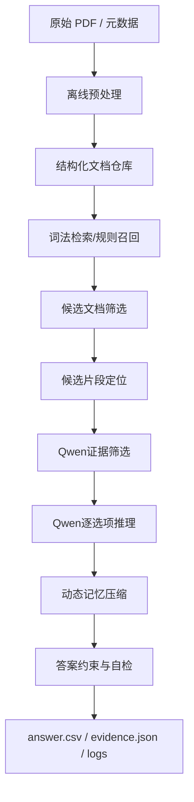

### **可行方案的核心是：做一个“合规预处理 + 词法召回 + Qwen 证据筛选/推理 + 动态记忆压缩 + 严格答案约束”的分层 Agent，而不是把整篇长文档直接塞给模型。**

这道题本质上不是“谁的大模型更强”，而是“谁能在规则内，把金融长文档的检索、证据组织、推理和 Token 控制做成稳定工程系统”。基于你给的赛题页面，一个**高可行、可复现、合规风险低**的路线，是以**文档工程能力和 Agent 编排能力**为主，以 Qwen 作为正式答题阶段唯一模型能力来源。赛题原文明确要求：推理问答阶段必须使用 Qwen 系列模型 API，且非 Qwen 模型不能参与正式检索、排序、召回、纠错，但 OCR、版面分析、表格恢复、PDF 转结构化文本等预处理是允许的。[Tianchi](https://tianchi.aliyun.com/competition/entrance/532486/information)

### **整体判断**

从赛题设计看，最优解大概率不是单一“大 Prompt”，而是一个**四层架构**：

1. **离线预处理层**：把 PDF 解析成高质量、可定位、可切片、可追溯的结构化文本。
2. **在线检索与候选证据层**：先用低成本规则/词法方法找候选文档和候选片段。
3. **Qwen 推理与记忆压缩层**：只把少量高价值证据喂给 Qwen，让它做逐选项判断、数值比较、跨文档整合和压缩记忆。
4. **答案约束与审计层**：把输出强约束成合法答案，同时记录 evidence.json、token 统计和运行日志，兼顾线上提交和 B 榜代码审核要求。[Tianchi](https://tianchi.aliyun.com/competition/entrance/532486/information)

---

### **一、赛题约束下的推荐总体架构**

#### **1. 架构目标**

这个架构要同时满足四个目标：

第一是**准确率优先**。赛题评分虽然考虑 Token，但总分主体仍由准确率决定，Token 只是 30% 权重的调节项。  
第二是**合规**。任何非 Qwen 的语义召回、向量排序、rerank、答案纠错都不要进入正式答题链。  
第三是**可解释可追溯**。因为官方样例已经明显引导 evidence_retrieval 结构，B 榜前 15 还要交完整代码包。  
第四是**成本可控**。不能每题全量读所有文档，否则很容易突破 5,000,000 Token 预算线。[Tianchi](https://tianchi.aliyun.com/competition/entrance/532486/information)

#### **2. 推荐分层**

建议采用下面这套分层：



---

### **二、推荐的技术架构方案**

#### **1. 离线预处理层：决定上限的不是模型，而是文档质量**

这层是最值得投入工程资源的地方，因为赛题里有财报、保险条款、监管法规、金融合同、研报，很多关键信息并不在普通正文里，而在：

- 表格
- 条款编号
- 页眉页脚附近的章节结构
- 跨页段落
- 附录和定义章节
- 多级标题下的例外条件

赛题明确允许在**数据预处理 / 文档解析阶段**使用 OCR、版面分析、表格恢复、阅读顺序还原、PDF 转结构化文本等非 Qwen 工具，因此这里建议做重一点。[Tianchi](https://tianchi.aliyun.com/competition/entrance/532486/information)

你可以把离线预处理做成以下产物。

#### **2. 文档标准化结果设计**

每份文档预处理后，不只是得到一个 txt，而是得到一个结构化 JSON。建议至少包含这些字段：

| 字段 | 说明 |
|---|---|
| doc_id | 官方文档编号 |
| title | 文档标题 |
| domain | 领域，如 insurance / regulatory / financial_reports |
| page_no | 页码 |
| section_path | 章节路径，如“第三章/信息披露/研发投入” |
| chunk_id | 切片编号 |
| chunk_text | 当前片段文本 |
| chunk_type | prose / table / clause / header / footer / appendix |
| clause_no | 条款编号，如“第四十七条” |
| table_title | 表格标题 |
| entities | 规则抽取出的实体，如公司名、产品名、法规名 |
| numbers | 金额、比例、期限、日期等结构化数值 |
| anchors | 用于检索的关键词锚点 |
| source_span | 原文起止位置，用于追溯 |

重点不是“字段越多越好”，而是**保证后续检索能做精准过滤和证据回指**。

#### **3. 切片策略不要只按固定字数**

固定 512/1024 字切片在这题里会吃亏，因为法规、合同、保险条款都有天然结构。更好的方式是**结构优先、长度兜底**：

- 法规/条款：按“条、款、项”切
- 财报：按章节标题 + 表格作为独立块
- 保险条款：按责任/免责/给付/退保/现金价值等模块切
- 研报：按摘要、投资逻辑、财务预测、风险提示切
- 超长块再做二级切分，保留 overlap

建议切成三类索引单元：

- **Section 级**：用于粗召回
- **Chunk 级**：用于正式证据
- **Table/Clause 级**：用于数字题和法条题的精准命中

这样能减少无效 Token。

---

### **三、在线答题架构：两阶段检索 + 两阶段推理**

#### **1. A 榜和 B 榜要分开设计**

赛题写得很清楚：

- **A 榜**会提供相对明确的文档关联信息，适合开发调试
- **B 榜**不直接给 doc_ids，要先做候选文档检索

所以系统要天然支持两种模式。[Tianchi](https://tianchi.aliyun.com/competition/entrance/532486/information)

A 榜模式下，流程可以更短：

- 直接读取 doc_ids 对应文档
- 在指定文档内做片段检索
- 用 Qwen 推理

B 榜模式下，要多一个**候选文档召回层**：

- 先从 domain 内做文档级召回
- 再进入片段级检索和推理

#### **2. 推荐的检索架构：词法主召回，Qwen 做精筛**

为了尽量规避合规风险，我更推荐下面的思路：

**第一层：纯规则 / 词法召回**

用这些能力做主召回：

- BM25
- TF-IDF
- 倒排索引
- 条款编号匹配
- 标题词匹配
- 数字词匹配
- 同义词字典扩展
- 领域术语词典扩展

这些都不依赖外部语义模型，合规且稳定。

**第二层：Qwen 证据筛选**

把第一层召回出的 top-k 文档或 chunk，交给 Qwen 做：

- 文档相关性判断
- 选项级证据相关性打分
- 噪声段剔除
- 是否需要补充检索的决定

这样既满足“推理阶段使用 Qwen”，也避免把所有候选段落全喂进去。

#### **3. 文档检索和片段检索要分开**

建议采用“doc-level → chunk-level”双层检索。

##### **doc-level**

目标：在 B 榜先把候选文档数量从几十篇降到 3 \~ 8 篇。

特征可以包括：

- 题干关键词与文档标题重合度
- 题干实体与文档实体重合度
- 选项中的公司名、产品名、法规名、年份、指标名
- 条款编号或术语命中
- domain 内主题词覆盖率

##### **chunk-level**

在候选文档里，再按题干和选项逐项检索 chunk。  
这里不要只搜题干，还要**题干 + 每个选项分别搜一次**，因为很多多选题的关键差异藏在选项的细小表述里。

建议召回四组片段：

- 题干相关片段
- A 选项相关片段
- B 选项相关片段
- C/D 同理

然后去重、合并相邻 chunk，形成最终证据包。

---

### **四、Agent 核心：动态记忆压缩不是“总结”，而是“证据账本”**

赛题反复强调“动态记忆压缩”。很多人会误解成普通摘要，其实这题真正需要的是**带结构的短期工作记忆**，而不是泛泛总结。

#### **1. 不要把摘要当记忆，要把事实当记忆**

建议设计三层记忆：

##### **原始证据记忆 Raw Evidence**

保存精确引用，不做改写。  
例如：

- doc_id
- page_no
- section_path
- quoted_text
- option_ref

这是为了审计和回溯。

##### **结构化事实记忆 Fact Memory**

把证据转成机器可用的原子事实，例如：

- `主体=比亚迪`
- `年份=2025`
- `营业收入=xxxx`
- `比较对象=2024`
- `关系=增长`

或者：

- `法规=上市公司章程指引`
- `条款=第四十七条`
- `条件=被担保方资产负债率>70%`
- `结论=须经股东大会审议`

##### **推理中间记忆 Reasoning Memory**

记录每个选项当前状态：

- evidence_found / insufficient / conflict
- preliminary_true / preliminary_false / uncertain
- missing_fields
- need_followup_retrieval

这层记忆才是真正帮助控 Token 的关键，因为后续轮次只需补齐缺口，不必把前面所有证据重放一遍。

#### **2. 压缩方式建议**

不要做“全文摘要压缩”，而要做**面向问题的选择性压缩**。

一个可行模板是：

```json
{
  "qid": "fin_a_001",
  "question_focus": ["连续两年年度报告", "经营业绩变化", "营业收入", "净利润", "现金流", "研发投入占比"],
  "facts": [
    {"subject":"比亚迪","year":"2024","metric":"营业收入","value":"X"},
    {"subject":"比亚迪","year":"2025","metric":"营业收入","value":"Y"},
    {"subject":"比亚迪","year":"2024","metric":"研发投入占营业收入比例","value":"P"},
    {"subject":"比亚迪","year":"2025","metric":"研发投入占营业收入比例","value":"Q"}
  ],
  "option_status": {
    "A":"supported",
    "B":"refuted",
    "C":"supported",
    "D":"needs_check"
  }
}
```

Qwen 后续只基于这份压缩记忆补查 D，而不是重读全部年报。

---

### **五、不同题型的推理策略要分流**

#### **1. 单选题**

单选题可以做成“逐项判断 + 互斥选择”。  
流程最好不是直接问“答案是什么”，而是：

- 对每个选项输出 true/false/uncertain
- 如果多个为 true，则再做冲突消解
- 最终只保留一个字母

#### **2. 多选题**

这是最难的。赛题明确说多选题**不设置部分分，漏选、错选、多选均错**，所以要格外保守。[Tianchi](https://tianchi.aliyun.com/competition/entrance/532486/information)

推荐策略是：

- 每个选项独立判断
- 只有“证据明确支持”才纳入
- “高度怀疑但证据不足”按 false 处理
- 最后按字母排序、去重

这比一次性让模型输出“ACD”更稳。

#### **3. 判断题**

判断题表面简单，实际常见陷阱是：

- 选项 A/B 的含义不一定固定对应对错
- 题目里会写“具体含义以题目文件中的选项为准”

所以系统必须先解析选项映射，再做真假判断，不能写死 A=true。

---

### **六、五大领域的专用子策略**

赛题覆盖五个金融长文档领域，不同领域要做轻量专用模板，否则同一套 Prompt 很容易失真。[Tianchi](https://tianchi.aliyun.com/competition/entrance/532486/information)

#### **1. 保险条款 insurance**

重点难点在：

- 责任触发条件
- 除外责任
- 已交保费、现金价值、账户价值
- 身故保险金、退保金额、领取规则
- 多产品比较

这里建议建立专门的规则抽取器，识别：

- 给付公式
- min/max 约束
- “且/或/不低于/以较大者为准”
- 生效日、等待期、豁免条件

很多题不是“找一句话”，而是“读公式 + 带入条件”。

#### **2. 监管法规 regulatory**

这是最适合做**条款级索引**的领域。  
建议对“第X条、第X款、第X项”建立强索引，并维护法规名称别名。

推理上要特别注意：

- 是否“必须”
- 普通决议 vs 特别决议
- 生效时间
- 上位法与下位规则
- 例外情形

这类题通常最吃“精准法条定位”。

#### **3. 金融合同 financial_contracts**

重点是：

- 发行规模
- 利率/票息
- 评级
- 偿付顺序
- 特殊条款
- 时间条件和权利义务

合同题的错误常见于跨章节引用，所以 chunk 检索要保留上下文窗口。

#### **4. 财务报表 financial_reports**

这里最依赖表格恢复质量。  
建议把财报三张表、研发投入、分红政策、经营情况讨论做独立结构化。

最好离线提取成：

- 年度
- 指标名
- 数值
- 单位
- 同比/环比
- 所在表格标题

因为很多题实质是“跨两年指标比对”。

#### **5. 行业研报 research**

难点在于表述松散、结论分散、比较多。  
这里需要更强的“观点-证据”拆解：

- 行业趋势判断
- 公司横向比较
- 盈利预测
- 风险提示
- 研究结论

建议把研报切成“观点块”，而不是只按字数切。

---

### **七、推荐的在线推理链路**

下面是一条可落地的单题执行路径。

#### **步骤 1：题目解析**

先解析出：

- qid
- domain
- split
- answer_format
- question
- options
- 已知 doc_ids（A 榜有）
- 关键实体、年份、金额、比例、法规名、公司名、产品名

这一层尽量规则化，不要浪费模型调用。

#### **步骤 2：候选文档确定**

- A 榜：直接用 doc_ids
- B 榜：domain 内文档级 BM25 + 规则打分，取 top 5 \~ 8

#### **步骤 3：候选片段召回**

对题干和各选项分别检索，召回 chunk top n。  
再做相邻合并和去重。

#### **步骤 4：Qwen 证据筛选**

给 Qwen 一小批候选片段，让它输出：

- 哪些片段与哪一选项相关
- 哪些片段只是背景噪声
- 哪些选项还缺证据

这一步可替代传统 reranker。

#### **步骤 5：Qwen 逐选项推理**

让 Qwen 按选项逐一输出：

- 判断：support / refute / insufficient
- 依据：引用哪几个证据块
- 若涉及数字，展示比较或计算

不要让它直接输出最后字母，先做选项级布尔判断。

#### **步骤 6：动态记忆压缩**

把已确认的事实压缩成结构化记忆。  
如果还有 uncertain 选项，再做补检索。

#### **步骤 7：答案生成与合法化**

根据题型生成：

- mcq：单个字母
- multi：按字母排序拼接
- tf：按题目映射生成 A/B

再做合法性校验：

- 是否为空
- 是否重复
- 是否包含非法字符
- 多选是否已排序

#### **步骤 8：输出审计结果**

每题保留：

- answer
- evidence list
- token usage
- intermediate logs

最后汇总成 `answer.csv`，并额外生成 `evidence.json` 以备 B 榜代码审核。

---

### **八、Prompt 设计建议：不要一个万能 Prompt，要三类模板**

#### **1. 证据筛选 Prompt**

用途是从候选片段里挑出真正与选项判断有关的证据。  
要求输出结构化 JSON，而不是自由文本。

#### **2. 逐选项判断 Prompt**

用途是对 A/B/C/D 各自做 support/refute/insufficient。  
强制要求给出“证据块编号 + 判断理由”。

#### **3. 压缩记忆 Prompt**

用途是把已有证据整理成短小、结构化、可继续推理的事实账本。  
要求只保留：

- 数值
- 条件
- 关系
- 结论
- 未解决问题

这样最省 Token。

---

### **九、Token 优化策略：重点压在“少读”和“少重复读”**

赛题里 baseline 的总 Token 很高，但准确率并不理想，这说明“直接长上下文硬喂”性价比很差。[Tianchi](https://tianchi.aliyun.com/competition/entrance/532486/information)

真正有效的 Token 优化点不在省输出，而在减少无效输入。

#### **1. 一题多轮，但每轮输入更短**

宁可 3 次小调用，也不要 1 次超长全量调用。  
因为长上下文里噪声太多，模型判断会发散。

#### **2. 按需补检索，不全量重跑**

只有某个选项 insufficient 时，才追加相关检索，不要整题从头再来。

#### **3. 记忆压缩后复用**

同一题内部，压缩后的事实账本可在后续轮次直接使用。

#### **4. 文档级缓存**

A 榜经常会多题引用同一文档。  
可以缓存：

- 文档结构索引
- 常见条款位置
- 已抽出的表格指标

前提是这些是预处理产物或规则产物，而不是非 Qwen 语义结论。

#### **5. 题型分流**

数字计算题、法条判断题、比较题分别用不同模板，能明显减少无关解释。

---

### **十、建议的项目目录与工程拆分**

为了兼容 B 榜前 15 的代码审核要求，工程目录最好一开始就按审计方式组织。赛题要求压缩包里包含 `answer.csv`、`evidence.json`、`processed_data/`、`agent/`、`script/`、`logs/`、`requirements.txt`、`README.md` 等内容。[Tianchi](https://tianchi.aliyun.com/competition/entrance/532486/information)

建议目录可以这样设计：

```text
submission/
├── answer.csv
├── evidence.json
├── processed_data/
│   ├── raw_pdf_index.json
│   ├── docs_structured/
│   ├── chunks/
│   ├── tables/
│   └── lexical_index/
├── agent/
│   ├── planner.py
│   ├── retriever.py
│   ├── evidence_selector.py
│   ├── reasoner.py
│   ├── memory_manager.py
│   ├── answer_formatter.py
│   └── token_tracker.py
├── script/
│   ├── preprocess.py
│   ├── build_index.py
│   ├── run_a.py
│   ├── run_b.py
│   └── package_submission.py
├── logs/
├── requirements.txt
└── README.md
```

---

### **十一、实施路径：建议按四个阶段推进**

#### **阶段一：先做合规可跑 baseline（1 周）**

目标不是高分，而是打通全链路。

这阶段只做：

- PDF 解析
- 结构化切片
- BM25 检索
- A 榜已知 doc_ids 内检索
- 单轮 Qwen 推理
- answer.csv 生成
- token 统计

验收标准是：  
能稳定跑完 A 榜样例，输出格式完全合法。

#### **阶段二：做准确率主提升（1 \~ 2 周）**

重点投入：

- 表格恢复
- 条款级切片
- 逐选项判断
- 证据筛选
- 多轮补检索
- 领域专用 Prompt
- 数值比较与公式计算模板

这一阶段通常会带来最大准确率提升。

#### **阶段三：做 Token 优化（1 周）**

重点做：

- 召回 top-k 收缩
- 记忆压缩
- 文档与证据缓存
- 失败重试策略精简
- 题型分流

目标是把 Token 压到舒适区，而不掉点。

#### **阶段四：做 B 榜和代码审计准备（最后 1 周）**

重点包括：

- B 榜无 doc_ids 的文档级检索强化
- 全量日志记录
- evidence.json 格式固定
- 一键运行脚本
- 复现实验文档
- requirements 冻结

---

### **十二、推荐的最小可行版本 MVP**

如果你现在时间紧，我建议先上一个**最小可行版本**，比一开始追求花哨 Agent 更实在。

MVP 应包含：

- MinerU 或等效工具做 PDF 结构化解析
- 按 section/clause/table 切片
- Whoosh / Elasticsearch / BM25 做词法召回
- A 榜直接按 doc_ids 检索
- B 榜先做文档级 BM25
- Qwen 做两步：
  - 候选证据筛选
  - 逐选项真伪判断
- 固定格式输出 answer.csv 与 evidence.json
- 严格 token 统计

只要这套跑顺，已经比“全文硬塞模型”强很多。

---

### **十三、我对最终落地方案的建议结论**

如果以“可行、合规、工程上能跑通、后续能冲榜”为标准，我最推荐的是下面这套：

**离线重预处理，在线轻上下文。**  
也就是：

- 用允许的非 Qwen 工具把 PDF 尽量解析好
- 正式答题阶段坚持“词法召回 + Qwen 精筛 + Qwen 推理”
- 用结构化事实记忆替代长摘要
- 用逐选项判断替代一次性输出答案
- 用严格答案后处理保证提交格式零失误
- 从一开始就按可审计的工程目录和日志体系组织

这套方案的优势是：

- 合规边界清晰
- 准确率有提升空间
- Token 可控
- 对 A 榜和 B 榜都适用
- 代码审核时也讲得通

这个可视化计算器页面支持发布和分享；如果你想，我可以继续把这套方案展开成**更具体的技术蓝图**，例如补上：
- 模块职责说明
- 关键 Prompt 模板
- 检索打分公式
- evidence.json 设计
- 里程碑排期表
- Python 项目骨架代码

也可以直接帮你整理成一份可交付的技术方案文档。