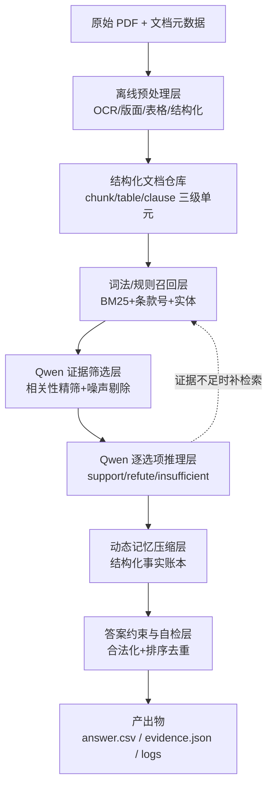
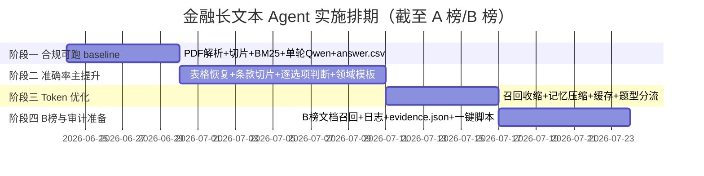

### **可行方案的核心：离线用允许的非 Qwen 工具把 PDF 重度结构化，在线坚持"词法召回 + Qwen 精筛 + Qwen 逐选项推理 + 结构化记忆压缩 + 严格答案后处理"的分层 Agent，而不是把长文档直接硬喂模型。**

这道题是蚂蚁 AFAC 专题下的「金融长文本 Agent」赛题，奖金 100 万，本质考的不是"谁的模型强"，而是"谁能在规则内把金融长文档的检索、证据组织、推理和 Token 控制做成稳定工程"。今天是 2026-06-24，正处于 A 榜评测期（6 月 8 日至 7 月 21 日），距 A 榜结束还有约四周，B 榜紧接着在 7 月 22 日至 24 日，时间窗口偏紧，所以方案要兼顾"快速跑通"与"可冲榜"。[Tianchi](https://tianchi.aliyun.com/competition/entrance/532486/information)

### **一、先锁死四条硬约束，它们直接决定选型**

在画架构之前，有四条规则是不可逾越的红线，任何方案都必须先满足。

**第一，推理链路只能用 Qwen，且只能走百炼或魔搭。** 答题阶段的检索重排、证据判断、答案投票、纠错全部要由 Qwen 完成，不能用任何其他开闭源模型替代。

**第二，这是最容易翻车的一条——非 Qwen 模型产出的"语义能力"不得进入正式答题。** 规则明确禁止：使用非 Qwen 模型生成的向量、排序、召回结果参与答题；用它们做 rerank、候选过滤、答案投票、纠错；直接使用预处理阶段产出的语义摘要、FAQ、结论、知识库。**它的直接后果是：你不能用 BGE、m3e、OpenAI embedding 这类第三方向量来做语义检索。** 合规的召回手段只剩两类——纯词法/规则算法（BM25、TF-IDF、条款编号匹配，这些不是"模型生成的向量"，完全合法），以及 Qwen 自家的能力。最稳的工程基线是：**以词法检索做召回主力，以 Qwen 做语义重排和证据筛选。**

**第三，预处理阶段是允许用非 Qwen 工具的"自由区"。** OCR、版面分析、表格恢复、阅读顺序还原、PDF 转结构化（如 MinerU）都允许。这里是把准确率做上去的关键投入点，尤其财报和合同的关键数字几乎全在表格里。

**第四，评分是乘性公式，准确率主导。** `FinalScore = 100 × Accuracy × (0.7 + 0.3 × TokenScore)`，其中 `TokenScore = max(0, min(1, (5,000,000 − TotalTokens) / 5,000,000))`。准确率是乘数主导项，Token 效率最多只能调节 30% 的系数；只要总 Token 控制在 500 万以内 TokenScore 就为正。结论很清晰：**优先冲准确率，在准确率不掉的前提下再压 Token。** 这一点在我上一轮给你的那个交互式评分计算器里能直接拖动验证。[Tianchi](https://tianchi.aliyun.com/competition/entrance/532486/information)

### **二、推荐的总体架构：四层分工**

整套系统建议拆成四层，离线重、在线轻，每一层职责单一、可单独测试、可单独审计。



下面逐层说明设计要点。

### **三、离线预处理层：决定准确率上限**

这层最值得投入，因为五个领域里很多关键信息不在普通正文，而在表格、条款编号、章节结构、跨页段落、附录定义里。赛题明确允许在此阶段使用 OCR、版面分析、表格恢复、阅读顺序还原等非 Qwen 工具，因此建议做重。[Tianchi](https://tianchi.aliyun.com/competition/entrance/532486/information)

每份文档预处理后不应只是一个 txt，而要落成结构化单元。建议每个切片至少携带这些字段。

| 字段 | 作用 |
|---|---|
| doc_id / title / domain | 文档定位与领域分流 |
| page_no / section_path | 页码与章节路径，用于追溯 |
| chunk_id / chunk_type | 片段编号与类型（prose/table/clause/header/appendix）|
| clause_no / table_title | 条款编号与表格标题，法条题和数字题精准命中 |
| numbers / entities | 规则抽取的金额、比例、期限、公司名、产品名、法规名 |
| source_span | 原文起止位置，供 evidence.json 回指 |

切片策略不要只按固定字数，应**结构优先、长度兜底**：法规按"条/款/项"切，财报按章节加表格独立块，保险条款按责任/免责/给付/退保/现金价值模块切，研报按观点块切，超长块再二级切分并保留 overlap。最终建议产出三级索引单元——Section 级用于粗召回，Chunk 级用于正式证据，Table/Clause 级用于数字题和法条题精准命中。

### **四、在线检索：A/B 榜分流 + 两层检索**

赛题写明 A 榜给 doc_ids、适合调试，B 榜不给 doc_ids、需先做候选文档检索，更接近盲测。所以系统要天然支持两种模式。[Tianchi](https://tianchi.aliyun.com/competition/entrance/532486/information)

**A 榜模式**流程更短：直接读 doc_ids 对应文档 → 文档内片段检索 → Qwen 推理。**B 榜模式**要多一层文档级召回：先在 domain 内把候选文档从几十篇降到 3 至 8 篇，再进入片段检索和推理。

检索本身建议做成"doc-level → chunk-level"双层，且为了规避合规风险，**主召回用纯词法/规则**（BM25、倒排索引、条款编号匹配、标题词匹配、数字词匹配、领域术语词典扩展），**精筛交给 Qwen**（判断候选片段与哪个选项相关、剔除噪声段、决定是否补检索）。这样既满足"推理阶段用 Qwen"，又避免把所有候选段落全量喂入。

一个容易被忽略的细节：chunk 检索不要只搜题干，要**题干 + 每个选项各搜一次**，因为多选题的关键差异常藏在选项的细小表述里。召回题干相关片段和 A/B/C/D 各自相关片段后再去重合并。

### **五、Agent 核心：记忆压缩是"证据账本"，不是"摘要"**

赛题反复强调"动态记忆压缩"，很多人误解成普通摘要，其实这题需要的是**带结构的短期工作记忆**。建议设计三层记忆：原始证据记忆（保存 doc_id、page_no、quoted_text 等精确引用，供审计）、结构化事实记忆（把证据转成原子事实，如 `主体=比亚迪 / 年份=2025 / 营业收入=Y`）、推理中间记忆（记录每个选项当前状态：supported/refuted/uncertain、缺哪些字段、是否要补检索）。

这层中间记忆才是控 Token 的关键——后续轮次只补齐缺口，不必把前面所有证据重放。压缩要做"面向问题的选择性压缩"，例如：

```json
{
  "qid": "fin_a_001",
  "facts": [
    {"subject":"比亚迪","year":"2024","metric":"营业收入","value":"X"},
    {"subject":"比亚迪","year":"2025","metric":"营业收入","value":"Y"},
    {"subject":"比亚迪","year":"2025","metric":"研发投入占比","value":"Q"}
  ],
  "option_status": {"A":"supported","B":"refuted","C":"supported","D":"needs_check"}
}
```

Qwen 后续只针对 D 补查，而不是重读整份年报。

### **六、按题型与领域分流推理**

**题型分流**上，单选题做"逐项 true/false/uncertain + 互斥消解"；多选题最危险，赛题明确**不设部分分，漏选错选多选均错**，因此要保守——只有"证据明确支持"才纳入，"高度怀疑但证据不足"按 false 处理，最后按字母排序去重；判断题要先解析选项映射（题目写明"具体含义以选项为准"），不能写死 A=true。[Tianchi](https://tianchi.aliyun.com/competition/entrance/532486/information)

**领域分流**上各做轻量专用模板：保险条款重在给付公式和 min/max、"以较大者为准"等约束的带入计算；监管法规最适合做条款级强索引，注意"必须/普通决议/特别决议/生效时间/例外情形"（这正是官方样例 reg_a_014 的考点）；金融合同注意发行规模、票息、评级、偿付顺序和跨章节引用；财务报表最依赖表格恢复质量，应离线把指标按"年度-指标名-数值-单位-同比"结构化，因为很多题是跨两年比对；行业研报表述松散，需按"观点-证据"拆解。

### **七、Token 优化：压在"少读"和"少重复读"**

baseline 总 Token 高达 687 万却只有 15% 准确率，说明长上下文硬喂性价比极差。[Tianchi](https://tianchi.aliyun.com/competition/entrance/532486/information) 有效的优化点不在省输出，而在减少无效输入：宁可三次短调用也不要一次超长全量调用；只有某选项证据不足时才追加检索，不整题重跑；同题内复用压缩后的事实账本；缓存文档结构索引、常见条款位置、已抽表格指标（前提是这些属预处理或规则产物，而非非 Qwen 语义结论）；不同题型用不同模板减少无关解释。

### **八、工程目录：从一开始就按代码审核组织**

B 榜前 15 名要交完整可一键运行的代码包（不超过 1GB），所以目录一开始就按审计方式组织，避免最后返工。赛题要求包含 answer.csv、evidence.json、processed_data/、agent/、script/、logs/、requirements.txt、README.md。[Tianchi](https://tianchi.aliyun.com/competition/entrance/532486/information)

```text
submission/
├── answer.csv
├── evidence.json
├── processed_data/   # docs_structured / chunks / tables / lexical_index
├── agent/            # planner retriever evidence_selector reasoner memory_manager answer_formatter token_tracker
├── script/           # preprocess build_index run_a run_b package_submission
├── logs/
├── requirements.txt
└── README.md
```

### **九、实施路径：按今天的时间窗排四阶段**

今天是 6 月 24 日，A 榜 7 月 21 日结束、B 榜 7 月 22 日至 24 日，倒推约四周，建议节奏如下。



**阶段一（约 1 周）**目标是打通全链路而非高分：PDF 解析、结构化切片、BM25 检索、A 榜按已知 doc_ids 检索、单轮 Qwen 推理、生成合法 answer.csv 与 Token 统计。验收标准是能稳定跑完 A 榜样例且格式零失误。

**阶段二（约 1.5 周）**做准确率主提升，这阶段收益最大：重度表格恢复、条款级切片、逐选项判断、Qwen 证据筛选、多轮补检索、五领域专用 Prompt、数值比较与公式计算模板。

**阶段三（约 1 周）**做 Token 优化：收缩召回 top-k、记忆压缩、文档与证据缓存、精简重试、题型分流，目标是把 Token 压进舒适区而不掉点。

**阶段四（约 1 周）**做 B 榜与代码审计准备：强化无 doc_ids 的文档级检索、全量日志、固定 evidence.json 格式、一键运行脚本、复现文档、冻结 requirements。

### **十、如果时间紧，先上 MVP**

考虑到只剩约四周，我建议先上最小可行版本再迭代，比一开始追求花哨 Agent 更实在：用 MinerU 或等效工具做 PDF 结构化解析，按 section/clause/table 切片，用 BM25 做词法召回（A 榜按 doc_ids、B 榜先做文档级 BM25），Qwen 只做两步（候选证据筛选 + 逐选项真伪判断），固定格式输出 answer.csv 与 evidence.json，并严格统计 Token。这套跑顺后，已经远胜"全文硬塞模型"的 baseline。

总结一句落地原则就是：**离线重预处理、在线轻上下文，词法召回打底、Qwen 精筛与逐选项推理收口，用结构化事实账本替代长摘要，用严格后处理保证提交零失误。** 这套方案合规边界清晰、准确率有空间、Token 可控，对 A/B 榜都适用，代码审核时也讲得通。


### **这份技术蓝图把方案落到可执行层面:模块职责与调用边界、混合检索打分公式、三类核心 Prompt、evidence.json 字段规范,以及一套可直接长出代码的 Python 骨架——所有正式答题环节统一收口到唯一的 Qwen 调用出口,既保证合规又便于计 Token。**

下面按"模块职责 → 检索打分 → Prompt 模板 → 证据规范 → 项目骨架"五块展开,每一块都对应你之前看到的四层架构,可以直接作为开发任务拆解。

### **一、模块职责与调用边界**

整个系统的合规关键在于:**只有 `evidence_selector` 和 `reasoner` 两个模块允许调用 Qwen,且都必须经过唯一的 `llm_client` 出口**;检索、打分、召回、答案格式化全部用纯规则实现,绝不引入非 Qwen 的语义能力。下表是模块总览。

| 模块 | 输入 | 输出 | 是否调用 Qwen |
|---|---|---|---|
| `preprocess` | 原始 PDF + 元数据 | 结构化 chunk/table/clause | 否(可用 OCR/版面工具) |
| `build_index` | 结构化文档 | BM25 倒排 + 条款/实体索引 | 否 |
| `planner` | 单条题目 JSON | 题型/领域/实体/路由标记 | 否(纯规则解析) |
| `retriever` | 题目 + 索引 | 候选 doc 与候选 chunk | 否(词法/规则) |
| `evidence_selector` | 题目 + 候选 chunk | 选项级相关证据 + 噪声标记 | **是** |
| `reasoner` | 题目 + 精选证据 | 逐选项 support/refute/insufficient | **是** |
| `memory_manager` | 原始证据 | 结构化事实账本 | 是(压缩可选用) |
| `answer_formatter` | 逐选项判断 | 合法答案字母 | 否(纯规则) |
| `token_tracker` | 每次 API 响应 | 累计 token 统计 | 否 |

需要重点说明四个核心模块的内部逻辑。

`planner` 是纯规则的题目解析器,负责从题目里抽出领域、题型、年份、金额、比例、公司名、法规名、条款号,并决定走 A 榜路径(直接用 `doc_ids`)还是 B 榜路径(先文档召回)。它不调模型,目的是把后续模型调用的目标缩到最小。

`retriever` 是召回主力,完全用词法和规则实现。它分两层:doc-level 在 B 榜把候选文档从几十篇压到 3~8 篇;chunk-level 用"题干 + 每个选项各检索一次"的方式召回片段,再做相邻合并和去重。这一层是 Token 控制的第一道闸门。

`evidence_selector` 是第一个 Qwen 模块,承担传统 reranker 的角色,但用 Qwen 做,以规避"非 Qwen 排序结果参与答题"的红线。它只输出"哪些 chunk 与哪个选项相关、哪些是噪声、哪些选项证据不足",不下结论。

`reasoner` 是第二个 Qwen 模块,基于精选证据对 A/B/C/D 逐项判 support/refute/insufficient,涉及数字时必须显式给出比较或计算过程。它输出布尔级判断而非直接给字母,最终字母由 `answer_formatter` 按题型规则合成。[Tianchi](https://tianchi.aliyun.com/competition/entrance/532486/information)

### **二、混合检索打分公式**

doc-level 召回采用多特征加权打分,所有分量先归一化到 $[0,1]$,再加权求和并按权重总和归一:

$$\text{DocScore}(q,d) = \frac{w_1\widehat{\text{BM25}} + w_2\,\text{TitleSim} + w_3\,\text{EntityOverlap} + w_4\,\text{ClauseHit} + w_5\,\text{NumHit}}{\sum_i w_i}$$

其中 BM25 本身按标准公式计算,$f(t,d)$ 是词频,$|d|$ 是文档长度,$\text{avgdl}$ 是平均长度,经验取 $k_1\in[1.2,2.0]$、$b=0.75$:

$$\text{BM25}(q,d)=\sum_{t\in q}\text{IDF}(t)\cdot\frac{f(t,d)\,(k_1+1)}{f(t,d)+k_1\!\left(1-b+b\frac{|d|}{\text{avgdl}}\right)}$$

chunk-level 在候选文档内做选项感知打分,对题干 $q$ 与每个选项 $o$ 的拼接串分别检索,取最大值,并叠加片段类型先验 $\text{TypePrior}$(法规题给 clause 块加权、财报题给 table 块加权):

$$\text{ChunkScore}(c)=\max_{o\in O}\Big[\alpha\,\widehat{\text{BM25}}(q\oplus o,\,c)\Big]+\beta\,\text{ClauseHit}(c)+\gamma\,\text{NumHit}(c)+\delta\,\text{TypePrior}(c,\text{domain})$$

权重不是固定的,应**按领域切换**:监管法规调高 $\text{ClauseHit}$,财务报表调高 $\text{NumHit}$ 和 table 先验,研报调高 BM25 和实体重合。下面这个调参器可以直观感受权重如何改变文档排序——用监管法规场景的四篇候选文档做了示例,拖动滑块看排名变化:从上面的调参器能看到一个关键现象:同样四篇候选文档,当 `clause` 权重高时法规条款文档排第一,而 `bm25` 权重高时高词频研报会被错误地顶上来——这正是为什么权重要按领域切换,而不能用一套固定值。

### **三、三类核心 Prompt 模板**

正式答题只用两类 Qwen 调用(证据筛选、逐选项推理),外加一个可选的记忆压缩调用。三者都强制输出 JSON,便于解析和计 Token,且都明确要求"无证据不得臆断"。

**模板一:证据筛选(evidence_selector)**——替代传统 reranker 的角色,只筛不判。

```text
[System]
你是金融文档证据筛选器。只判断候选片段与各选项的相关性,不要给出题目答案。
仅依据提供的片段,不得使用外部知识。严格输出 JSON。

[User]
题目:{question}
选项:{A/B/C/D}
候选片段(带编号):
[c1] {chunk_text_1}
[c2] {chunk_text_2}
...
请输出:
{
  "relevant": [{"chunk_id":"c1","supports_option":["A"],"reason":"一句话"}],
  "noise": ["c3","c5"],
  "insufficient_options": ["D"]
}
```

**模板二:逐选项推理(reasoner)**——核心判断,涉及数字必须显式计算,绝不直接吐字母。

```text
[System]
你是严谨的金融合规/财务推理器。对每个选项独立判断 support/refute/insufficient。
所有结论必须引用给定证据编号;涉及金额、比例、期限时,必须写出比较或计算步骤。
证据不足时输出 insufficient,禁止猜测。严格输出 JSON。

[User]
题目:{question}  题型:{answer_format}
精选证据:
[e1] {doc_id} {clause_no/page} {quoted_text}
...
逐选项判断,输出:
{
  "A":{"verdict":"support","evidence":["e1"],"calc":"75% > 70% 触发"},
  "B":{"verdict":"refute","evidence":["e2"],"calc":"未列入特别决议事项"},
  "C":{"verdict":"support","evidence":["e3"],"calc":""},
  "D":{"verdict":"refute","evidence":["e4"],"calc":"修改章程须特别决议"}
}
```

**模板三:记忆压缩(memory_manager,可选)**——把多轮证据压成事实账本,只保留数值、条件、关系、结论和未解决项,后续轮次只补缺口。这一步在单题证据已足够时可跳过以省 Token。

题型与字母的最终合成交给纯规则的 `answer_formatter`:单选取唯一 support;多选取所有 support 并按字母排序拼接(漏选错选均判错,所以 insufficient 一律不纳入);判断题先读选项映射再产出 A/B。[Tianchi](https://tianchi.aliyun.com/competition/entrance/532486/information)

### **四、evidence.json 字段规范**

官方样例已强引导证据可追溯结构,且 B 榜前 15 要交 evidence.json,建议每题固定如下结构,字段命名与官方 reg_a_014 示例对齐:

```json
{
  "qid": "reg_a_014",
  "domain": "regulatory",
  "answer": "AC",
  "evidence_retrieval": [
    {
      "doc_id": "strict_csrc_035",
      "page_no": 12,
      "clause_no": "第四十七条",
      "quoted_clause": "公司下列对外担保行为,须经股东会审议通过:……(四)为资产负债率超过百分之七十的担保对象提供的担保;",
      "supports_option": ["A"],
      "reasoning": "子公司资产负债率75%>70%,触发审议,支持A"
    }
  ],
  "token_usage": {"prompt_tokens": 0, "completion_tokens": 0, "total_tokens": 0}
}
```

每条证据都带 `doc_id` + `clause_no/page_no` + `quoted_clause` 原文 + `supports_option` + `reasoning`,既满足审计可追溯,也方便自查错题时定位是检索丢证据还是推理出错。

### **五、Python 项目骨架**

下面是可直接长出实现的骨架,体现了"唯一 Qwen 出口 + Token 自动累计 + 模块单一职责"的设计。关键是 `LLMClient` 把所有 Qwen 调用和 Token 统计收口在一处。

```python
# agent/llm_client.py —— 唯一的 Qwen 调用出口,集中计 Token
from dashscope import Generation  # 百炼/魔搭 Qwen API

class LLMClient:
    def __init__(self, model="qwen-plus", tracker=None):
        self.model, self.tracker = model, tracker

    def chat(self, system, user, json_mode=True):
        resp = Generation.call(
            model=self.model,
            messages=[{"role": "system", "content": system},
                      {"role": "user", "content": user}],
            result_format="message",
            response_format={"type": "json_object"} if json_mode else None,
        )
        u = resp.usage  # 每次调用都登记,确保 summary 与实际一致
        if self.tracker:
            self.tracker.add(u.input_tokens, u.output_tokens)
        return resp.output.choices[0].message.content
```

```python
# agent/token_tracker.py —— 全程累计,生成 summary 行
class TokenTracker:
    def __init__(self):
        self.prompt = self.completion = 0
    def add(self, p, c):
        self.prompt += p; self.completion += c
    @property
    def total(self):
        return self.prompt + self.completion
    def summary_row(self):
        return {"qid": "summary", "answer": "",
                "prompt_tokens": self.prompt,
                "completion_tokens": self.completion,
                "total_tokens": self.total}
```

```python
# agent/pipeline.py —— 单题主链路:解析→召回→筛选→推理→合成
def answer_one(q, planner, retriever, selector, reasoner, formatter, memory):
    plan = planner.parse(q)                          # 纯规则:题型/领域/实体/路由
    docs = retriever.find_docs(plan)                 # A榜用doc_ids; B榜词法召回
    chunks = retriever.find_chunks(plan, docs)       # 题干+每个选项各检索一次
    picked = selector.select(plan, chunks)           # Qwen筛证据,替代reranker
    verdicts = reasoner.judge(plan, picked)          # Qwen逐选项support/refute
    if reasoner.has_insufficient(verdicts):          # 仅缺口选项才补检索,省Token
        more = retriever.expand(plan, verdicts)
        verdicts = reasoner.judge(plan, picked + more)
    ans = formatter.to_answer(plan, verdicts)        # 纯规则:排序去重合法化
    return ans, selector.evidence(picked, verdicts)  # 答案 + evidence.json 条目
```

```python
# script/run_a.py —— A 榜批量执行与提交文件生成
def main():
    tracker = TokenTracker()
    llm = LLMClient(model="qwen-plus", tracker=tracker)
    # ...装配 planner/retriever/selector(llm)/reasoner(llm)/formatter/memory
    rows, evidences = [], []
    for q in load_questions("A"):
        ans, ev = answer_one(q, planner, retriever, selector, reasoner, formatter, memory)
        rows.append({"qid": q["qid"], "answer": ans})       # 单题不单独记token
        evidences.append(ev)
    write_csv("answer.csv", [tracker.summary_row()] + rows) # 首行 summary 汇总
    write_json("evidence.json", evidences)
```

这套骨架的几个设计意图值得点明:`answer_one` 里"仅缺口选项才补检索"是 Token 控制的核心动作,避免整题重跑;`LLMClient` 是唯一 Qwen 出口,既保证合规边界清晰(检索/格式化模块物理上拿不到模型句柄),也让 Token 统计与实际消耗严格一致;`summary` 行放在 CSV 首行,符合官方提交格式要求。提交文件中 `total_tokens` 必须等于实际所有 Qwen 调用之和,这是计分的依据,务必由 `token_tracker` 自动产出而非手填。[Tianchi](https://tianchi.aliyun.com/competition/entrance/532486/information)

---

我已经把方案细化到了模块边界、打分公式、Prompt、证据规范和代码骨架五个层面,基本可以直接据此拆任务开工了。这两个可视化页面都支持发布和分享——如果你愿意,我可以把它们发布成在线页面方便团队传阅。另外我也可以再帮你做两件更落地的事:一是把整份技术蓝图整理成一份可下载的 Markdown/PDF 方案文档,二是补一张"五领域 × 题型"的专用 Prompt 与抽取规则对照表。你想先要哪个?